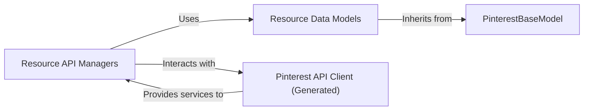

## Details

One paragraph explaining the functionality which is represented by this graph. What the main flow is and what is its purpose.

### PinterestBaseModel

The foundational base class for all data models representing Pinterest API resources. It provides common functionalities like serialization, deserialization, and consistent attribute handling, ensuring a uniform structure for all API response and request bodies.

**Related Classes/Methods**:

- <a href="https://github.com/pinterest/pinterest-python-sdk/blob/main/pinterest/utils/base_model.py#L1-L1" target="_blank" rel="noopener noreferrer">`pinterest.utils.base_model.PinterestBaseModel` (1:1)</a>

### Resource Data Models

Concrete implementations of `PinterestBaseModel` for specific API entities (e.g., `AdAccount`, `Pin`, `Campaign`). These classes define the specific attributes and types for each resource, inheriting the base functionalities from `PinterestBaseModel`. They serve as Data Transfer Objects (DTOs) for API interactions.

**Related Classes/Methods**:

- <a href="https://github.com/pinterest/pinterest-python-sdk/blob/main/pinterest/ads/ad_accounts.py#L1-L1" target="_blank" rel="noopener noreferrer">`pinterest.ads.ad_accounts.AdAccount` (1:1)</a>

- <a href="https://github.com/pinterest/pinterest-python-sdk/blob/main/pinterest/organic/pins.py#L1-L1" target="_blank" rel="noopener noreferrer">`pinterest.organic.pins.Pin` (1:1)</a>

### Resource API Managers

Classes responsible for encapsulating the CRUD (Create, Read, Update, Delete/List) operations for specific Pinterest API resources. They provide a high-level, developer-friendly interface, abstracting the direct interaction with the low-level generated API client and handling the mapping of request/response data to `Resource Data Models`. In this architecture, the `Resource Data Models` themselves often contain the API manager functionalities.

**Related Classes/Methods**:

- <a href="https://github.com/pinterest/pinterest-python-sdk/blob/main/pinterest/ads/ad_accounts.py#L1-L1" target="_blank" rel="noopener noreferrer">`pinterest.ads.ad_accounts.AdAccount` (1:1)</a>

- <a href="https://github.com/pinterest/pinterest-python-sdk/blob/main/pinterest/organic/pins.py#L1-L1" target="_blank" rel="noopener noreferrer">`pinterest.organic.pins.Pin` (1:1)</a>

### Pinterest API Client (Generated)

The underlying, auto-generated client library that handles the direct HTTP communication with the Pinterest API endpoints. This component is typically generated from an OpenAPI specification and provides low-level methods for making API calls. The `Resource API Managers` interact with this client to execute API requests.

**Related Classes/Methods**:

- `pinterest_generated_client` (1:1)

### [FAQ](https://github.com/CodeBoarding/GeneratedOnBoardings/tree/main?tab=readme-ov-file#faq)