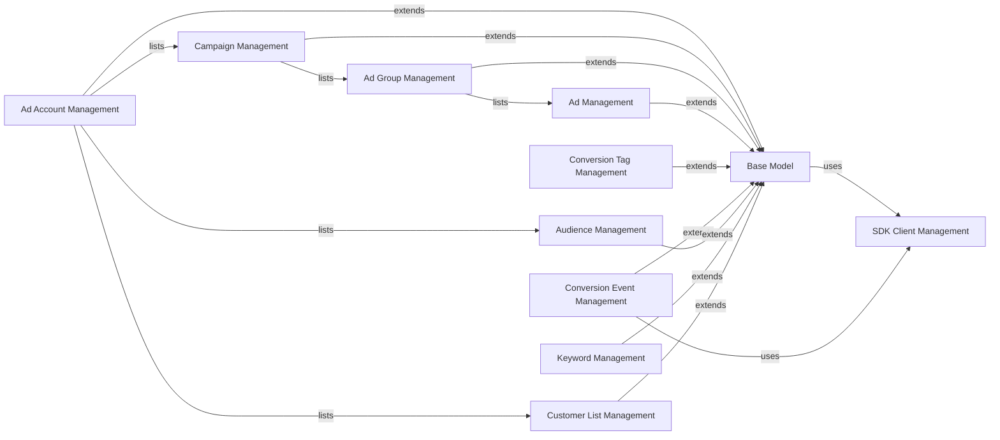

## Component Details

The Advertising API Management component is responsible for handling all aspects of advertising within the Pinterest API. It provides a structured way to manage various advertising entities such as ad accounts, campaigns, ad groups, ads, audiences, conversion tags, conversion events, customer lists, and keywords. This component is built upon the foundational 'Base Model' which provides common functionalities for API interactions, and it leverages the 'SDK Client Management' for authenticating and interacting with the Pinterest API.

### Ad Account Management
Manages Pinterest Ad Accounts, allowing for their creation and retrieval. It also provides methods to list associated entities such as campaigns, audiences, and customer lists within a specific ad account.

**Related Classes/Methods**:

- <a href="https://github.com/pinterest/pinterest-python-sdk/blob/master/pinterest/ads/ad_accounts.py#L22-L262" target="_blank" rel="noopener noreferrer">`pinterest.ads.ad_accounts.AdAccount` (22:262)</a>
- <a href="https://github.com/pinterest/pinterest-python-sdk/blob/master/pinterest/ads/ad_accounts.py#L27-L59" target="_blank" rel="noopener noreferrer">`pinterest.ads.ad_accounts.AdAccount.__init__` (27:59)</a>
- <a href="https://github.com/pinterest/pinterest-python-sdk/blob/master/pinterest/ads/ad_accounts.py#L102-L145" target="_blank" rel="noopener noreferrer">`pinterest.ads.ad_accounts.AdAccount.create` (102:145)</a>
- <a href="https://github.com/pinterest/pinterest-python-sdk/blob/master/pinterest/ads/ad_accounts.py#L147-L192" target="_blank" rel="noopener noreferrer">`pinterest.ads.ad_accounts.AdAccount.list_campaigns` (147:192)</a>
- <a href="https://github.com/pinterest/pinterest-python-sdk/blob/master/pinterest/ads/ad_accounts.py#L194-L229" target="_blank" rel="noopener noreferrer">`pinterest.ads.ad_accounts.AdAccount.list_audiences` (194:229)</a>
- <a href="https://github.com/pinterest/pinterest-python-sdk/blob/master/pinterest/ads/ad_accounts.py#L231-L262" target="_blank" rel="noopener noreferrer">`pinterest.ads.ad_accounts.AdAccount.list_customer_lists` (231:262)</a>

### Campaign Management
Handles the creation, retrieval, and modification of advertising campaigns. It allows setting budgets, changing campaign statuses (pause, activate, archive), and listing associated ad groups.

**Related Classes/Methods**:

- <a href="https://github.com/pinterest/pinterest-python-sdk/blob/master/pinterest/ads/campaigns.py#L21-L541" target="_blank" rel="noopener noreferrer">`pinterest.ads.campaigns.Campaign` (21:541)</a>
- <a href="https://github.com/pinterest/pinterest-python-sdk/blob/master/pinterest/ads/campaigns.py#L26-L70" target="_blank" rel="noopener noreferrer">`pinterest.ads.campaigns.Campaign.__init__` (26:70)</a>
- <a href="https://github.com/pinterest/pinterest-python-sdk/blob/master/pinterest/ads/campaigns.py#L159-L300" target="_blank" rel="noopener noreferrer">`pinterest.ads.campaigns.Campaign.create` (159:300)</a>
- <a href="https://github.com/pinterest/pinterest-python-sdk/blob/master/pinterest/ads/campaigns.py#L303-L365" target="_blank" rel="noopener noreferrer">`pinterest.ads.campaigns.Campaign.get_all` (303:365)</a>
- <a href="https://github.com/pinterest/pinterest-python-sdk/blob/master/pinterest/ads/campaigns.py#L367-L389" target="_blank" rel="noopener noreferrer">`pinterest.ads.campaigns.Campaign.set_lifetime_budget` (367:389)</a>
- <a href="https://github.com/pinterest/pinterest-python-sdk/blob/master/pinterest/ads/campaigns.py#L391-L413" target="_blank" rel="noopener noreferrer">`pinterest.ads.campaigns.Campaign.set_daily_budget` (391:413)</a>
- <a href="https://github.com/pinterest/pinterest-python-sdk/blob/master/pinterest/ads/campaigns.py#L433-L459" target="_blank" rel="noopener noreferrer">`pinterest.ads.campaigns.Campaign._change_status` (433:459)</a>
- <a href="https://github.com/pinterest/pinterest-python-sdk/blob/master/pinterest/ads/campaigns.py#L461-L468" target="_blank" rel="noopener noreferrer">`pinterest.ads.campaigns.Campaign.pause` (461:468)</a>
- <a href="https://github.com/pinterest/pinterest-python-sdk/blob/master/pinterest/ads/campaigns.py#L470-L477" target="_blank" rel="noopener noreferrer">`pinterest.ads.campaigns.Campaign.activate` (470:477)</a>
- <a href="https://github.com/pinterest/pinterest-python-sdk/blob/master/pinterest/ads/campaigns.py#L479-L486" target="_blank" rel="noopener noreferrer">`pinterest.ads.campaigns.Campaign.archive` (479:486)</a>
- <a href="https://github.com/pinterest/pinterest-python-sdk/blob/master/pinterest/ads/campaigns.py#L488-L512" target="_blank" rel="noopener noreferrer">`pinterest.ads.campaigns.Campaign.update_fields` (488:512)</a>
- <a href="https://github.com/pinterest/pinterest-python-sdk/blob/master/pinterest/ads/campaigns.py#L514-L541" target="_blank" rel="noopener noreferrer">`pinterest.ads.campaigns.Campaign.list_ad_groups` (514:541)</a>

### Ad Group Management
Responsible for managing ad groups, including their creation, retrieval, and updates. It also provides functionalities to list ads within an ad group and manage auto-targeting settings.

**Related Classes/Methods**:

- <a href="https://github.com/pinterest/pinterest-python-sdk/blob/master/pinterest/ads/ad_groups.py#L21-L499" target="_blank" rel="noopener noreferrer">`pinterest.ads.ad_groups.AdGroup` (21:499)</a>
- <a href="https://github.com/pinterest/pinterest-python-sdk/blob/master/pinterest/ads/ad_groups.py#L27-L80" target="_blank" rel="noopener noreferrer">`pinterest.ads.ad_groups.AdGroup.__init__` (27:80)</a>
- <a href="https://github.com/pinterest/pinterest-python-sdk/blob/master/pinterest/ads/ad_groups.py#L219-L351" target="_blank" rel="noopener noreferrer">`pinterest.ads.ad_groups.AdGroup.create` (219:351)</a>
- <a href="https://github.com/pinterest/pinterest-python-sdk/blob/master/pinterest/ads/ad_groups.py#L353-L380" target="_blank" rel="noopener noreferrer">`pinterest.ads.ad_groups.AdGroup.update_fields` (353:380)</a>
- <a href="https://github.com/pinterest/pinterest-python-sdk/blob/master/pinterest/ads/ad_groups.py#L383-L440" target="_blank" rel="noopener noreferrer">`pinterest.ads.ad_groups.AdGroup.get_all` (383:440)</a>
- <a href="https://github.com/pinterest/pinterest-python-sdk/blob/master/pinterest/ads/ad_groups.py#L442-L479" target="_blank" rel="noopener noreferrer">`pinterest.ads.ad_groups.AdGroup.list_ads` (442:479)</a>
- <a href="https://github.com/pinterest/pinterest-python-sdk/blob/master/pinterest/ads/ad_groups.py#L481-L489" target="_blank" rel="noopener noreferrer">`pinterest.ads.ad_groups.AdGroup.enable_auto_targeting` (481:489)</a>
- <a href="https://github.com/pinterest/pinterest-python-sdk/blob/master/pinterest/ads/ad_groups.py#L491-L499" target="_blank" rel="noopener noreferrer">`pinterest.ads.ad_groups.AdGroup.disable_auto_targeting` (491:499)</a>

### Ad Management
Focuses on managing individual advertisements, providing methods for their creation, retrieval, and updates.

**Related Classes/Methods**:

- <a href="https://github.com/pinterest/pinterest-python-sdk/blob/master/pinterest/ads/ads.py#L19-L444" target="_blank" rel="noopener noreferrer">`pinterest.ads.ads.Ad` (19:444)</a>
- <a href="https://github.com/pinterest/pinterest-python-sdk/blob/master/pinterest/ads/ads.py#L24-L81" target="_blank" rel="noopener noreferrer">`pinterest.ads.ads.Ad.__init__` (24:81)</a>
- <a href="https://github.com/pinterest/pinterest-python-sdk/blob/master/pinterest/ads/ads.py#L239-L339" target="_blank" rel="noopener noreferrer">`pinterest.ads.ads.Ad.create` (239:339)</a>
- <a href="https://github.com/pinterest/pinterest-python-sdk/blob/master/pinterest/ads/ads.py#L342-L418" target="_blank" rel="noopener noreferrer">`pinterest.ads.ads.Ad.get_all` (342:418)</a>
- <a href="https://github.com/pinterest/pinterest-python-sdk/blob/master/pinterest/ads/ads.py#L420-L444" target="_blank" rel="noopener noreferrer">`pinterest.ads.ads.Ad.update_fields` (420:444)</a>

### Audience Management
Allows for the creation, retrieval, and updating of audiences, which are groups of users targeted for advertising campaigns.

**Related Classes/Methods**:

- <a href="https://github.com/pinterest/pinterest-python-sdk/blob/master/pinterest/ads/audiences.py#L23-L275" target="_blank" rel="noopener noreferrer">`pinterest.ads.audiences.Audience` (23:275)</a>
- <a href="https://github.com/pinterest/pinterest-python-sdk/blob/master/pinterest/ads/audiences.py#L28-L50" target="_blank" rel="noopener noreferrer">`pinterest.ads.audiences.Audience.__init__` (28:50)</a>
- <a href="https://github.com/pinterest/pinterest-python-sdk/blob/master/pinterest/ads/audiences.py#L108-L189" target="_blank" rel="noopener noreferrer">`pinterest.ads.audiences.Audience.create` (108:189)</a>
- <a href="https://github.com/pinterest/pinterest-python-sdk/blob/master/pinterest/ads/audiences.py#L192-L251" target="_blank" rel="noopener noreferrer">`pinterest.ads.audiences.Audience.get_all` (192:251)</a>
- <a href="https://github.com/pinterest/pinterest-python-sdk/blob/master/pinterest/ads/audiences.py#L253-L275" target="_blank" rel="noopener noreferrer">`pinterest.ads.audiences.Audience.update_fields` (253:275)</a>

### Conversion Tag Management
Handles the creation and retrieval of conversion tags, which are used for tracking user actions. It also provides methods to retrieve page visit and OCPM eligible conversion tag events.

**Related Classes/Methods**:

- <a href="https://github.com/pinterest/pinterest-python-sdk/blob/master/pinterest/ads/conversion_tags.py#L20-L314" target="_blank" rel="noopener noreferrer">`pinterest.ads.conversion_tags.ConversionTag` (20:314)</a>
- <a href="https://github.com/pinterest/pinterest-python-sdk/blob/master/pinterest/ads/conversion_tags.py#L25-L60" target="_blank" rel="noopener noreferrer">`pinterest.ads.conversion_tags.ConversionTag.__init__` (25:60)</a>
- <a href="https://github.com/pinterest/pinterest-python-sdk/blob/master/pinterest/ads/conversion_tags.py#L108-L198" target="_blank" rel="noopener noreferrer">`pinterest.ads.conversion_tags.ConversionTag.create` (108:198)</a>
- <a href="https://github.com/pinterest/pinterest-python-sdk/blob/master/pinterest/ads/conversion_tags.py#L201-L236" target="_blank" rel="noopener noreferrer">`pinterest.ads.conversion_tags.ConversionTag.get_all` (201:236)</a>
- <a href="https://github.com/pinterest/pinterest-python-sdk/blob/master/pinterest/ads/conversion_tags.py#L239-L278" target="_blank" rel="noopener noreferrer">`pinterest.ads.conversion_tags.ConversionTag.get_page_visit_conversion_tag_events` (239:278)</a>
- <a href="https://github.com/pinterest/pinterest-python-sdk/blob/master/pinterest/ads/conversion_tags.py#L281-L314" target="_blank" rel="noopener noreferrer">`pinterest.ads.conversion_tags.ConversionTag.get_ocpm_eligible_conversion_tag_events` (281:314)</a>

### Conversion Event Management
Responsible for sending conversion events to Pinterest, enabling the tracking of specific user actions for advertising purposes.

**Related Classes/Methods**:

- <a href="https://github.com/pinterest/pinterest-python-sdk/blob/master/pinterest/ads/conversion_events.py#L96-L119" target="_blank" rel="noopener noreferrer">`pinterest.ads.conversion_events.Conversion.send_conversion_events` (96:119)</a>
- <a href="https://github.com/pinterest/pinterest-python-sdk/blob/master/pinterest/ads/conversion_events.py#L23-L93" target="_blank" rel="noopener noreferrer">`pinterest.ads.conversion_events.Conversion.create_conversion_event` (23:93)</a>

### Customer List Management
Handles customer lists, enabling their creation, retrieval, and updates. It also supports adding and removing records from customer lists.

**Related Classes/Methods**:

- <a href="https://github.com/pinterest/pinterest-python-sdk/blob/master/pinterest/ads/customer_lists.py#L19-L283" target="_blank" rel="noopener noreferrer">`pinterest.ads.customer_lists.CustomerList` (19:283)</a>
- <a href="https://github.com/pinterest/pinterest-python-sdk/blob/master/pinterest/ads/customer_lists.py#L24-L48" target="_blank" rel="noopener noreferrer">`pinterest.ads.customer_lists.CustomerList.__init__` (24:48)</a>
- <a href="https://github.com/pinterest/pinterest-python-sdk/blob/master/pinterest/ads/customer_lists.py#L107-L170" target="_blank" rel="noopener noreferrer">`pinterest.ads.customer_lists.CustomerList.create` (107:170)</a>
- <a href="https://github.com/pinterest/pinterest-python-sdk/blob/master/pinterest/ads/customer_lists.py#L172-L191" target="_blank" rel="noopener noreferrer">`pinterest.ads.customer_lists.CustomerList.update_fields` (172:191)</a>
- <a href="https://github.com/pinterest/pinterest-python-sdk/blob/master/pinterest/ads/customer_lists.py#L194-L244" target="_blank" rel="noopener noreferrer">`pinterest.ads.customer_lists.CustomerList.get_all` (194:244)</a>
- <a href="https://github.com/pinterest/pinterest-python-sdk/blob/master/pinterest/ads/customer_lists.py#L246-L265" target="_blank" rel="noopener noreferrer">`pinterest.ads.customer_lists.CustomerList.add_record` (246:265)</a>
- <a href="https://github.com/pinterest/pinterest-python-sdk/blob/master/pinterest/ads/customer_lists.py#L267-L283" target="_blank" rel="noopener noreferrer">`pinterest.ads.customer_lists.CustomerList.remove_record` (267:283)</a>

### Keyword Management
Manages keywords used in advertising, providing functionalities for their creation, retrieval, and updates.

**Related Classes/Methods**:

- <a href="https://github.com/pinterest/pinterest-python-sdk/blob/master/pinterest/ads/keywords.py#L20-L230" target="_blank" rel="noopener noreferrer">`pinterest.ads.keywords.Keyword` (20:230)</a>
- <a href="https://github.com/pinterest/pinterest-python-sdk/blob/master/pinterest/ads/keywords.py#L25-L46" target="_blank" rel="noopener noreferrer">`pinterest.ads.keywords.Keyword.__init__` (25:46)</a>
- <a href="https://github.com/pinterest/pinterest-python-sdk/blob/master/pinterest/ads/keywords.py#L89-L153" target="_blank" rel="noopener noreferrer">`pinterest.ads.keywords.Keyword.create` (89:153)</a>
- <a href="https://github.com/pinterest/pinterest-python-sdk/blob/master/pinterest/ads/keywords.py#L156-L205" target="_blank" rel="noopener noreferrer">`pinterest.ads.keywords.Keyword.get_all` (156:205)</a>
- <a href="https://github.com/pinterest/pinterest-python-sdk/blob/master/pinterest/ads/keywords.py#L207-L230" target="_blank" rel="noopener noreferrer">`pinterest.ads.keywords.Keyword.update_fields` (207:230)</a>

### Base Model
Provides foundational functionalities for all higher-level Pinterest API models. It includes methods for client retrieval, API instance creation, generic API method calls, and common operations like listing, creating, and updating resources. It also handles populating model fields from API responses.

**Related Classes/Methods**:

- <a href="https://github.com/pinterest/pinterest-python-sdk/blob/master/pinterest/utils/base_model.py#L15-L213" target="_blank" rel="noopener noreferrer">`pinterest.utils.base_model.PinterestBaseModel` (15:213)</a>
- <a href="https://github.com/pinterest/pinterest-python-sdk/blob/master/pinterest/utils/base_model.py#L20-L41" target="_blank" rel="noopener noreferrer">`pinterest.utils.base_model.PinterestBaseModel.__init__` (20:41)</a>
- <a href="https://github.com/pinterest/pinterest-python-sdk/blob/master/pinterest/utils/base_model.py#L52-L81" target="_blank" rel="noopener noreferrer">`pinterest.utils.base_model.PinterestBaseModel._populate_fields` (52:81)</a>
- <a href="https://github.com/pinterest/pinterest-python-sdk/blob/master/pinterest/utils/base_model.py#L87-L90" target="_blank" rel="noopener noreferrer">`pinterest.utils.base_model.PinterestBaseModel._get_client` (87:90)</a>
- <a href="https://github.com/pinterest/pinterest-python-sdk/blob/master/pinterest/utils/base_model.py#L93-L98" target="_blank" rel="noopener noreferrer">`pinterest.utils.base_model.PinterestBaseModel._get_api_instance` (93:98)</a>
- <a href="https://github.com/pinterest/pinterest-python-sdk/blob/master/pinterest/utils/base_model.py#L101-L108" target="_blank" rel="noopener noreferrer">`pinterest.utils.base_model.PinterestBaseModel._call_method` (101:108)</a>
- <a href="https://github.com/pinterest/pinterest-python-sdk/blob/master/pinterest/utils/base_model.py#L111-L163" target="_blank" rel="noopener noreferrer">`pinterest.utils.base_model.PinterestBaseModel._list` (111:163)</a>
- <a href="https://github.com/pinterest/pinterest-python-sdk/blob/master/pinterest/utils/base_model.py#L166-L183" target="_blank" rel="noopener noreferrer">`pinterest.utils.base_model.PinterestBaseModel._create` (166:183)</a>
- <a href="https://github.com/pinterest/pinterest-python-sdk/blob/master/pinterest/utils/base_model.py#L185-L213" target="_blank" rel="noopener noreferrer">`pinterest.utils.base_model.PinterestBaseModel._update` (185:213)</a>

### SDK Client Management
Initializes and manages the Pinterest SDK client, handling authentication and refreshing access tokens. It serves as the entry point for interacting with the Pinterest API.

**Related Classes/Methods**:

- `pinterest.client.PinterestSDKClient` (1:1000)
- `pinterest.client.PinterestSDKClient.create_client_with_token` (1:1000)
- `pinterest.client.PinterestSDKClient.create_client_with_refresh_token` (1:1000)
- `pinterest.client.PinterestSDKClient.set_default_access_token` (1:1000)
- `pinterest.client.PinterestSDKClient.set_default_refresh_token` (1:1000)
- `pinterest.client.PinterestSDKClient.create_default_client` (1:1000)
- `pinterest.client.PinterestSDKClient._init_default_sdk_client_from_env` (1:1000)
- `pinterest.client.PinterestSDKClient._get_access_token` (1:1000)
- `pinterest.client.PinterestSDKClient._get_config` (1:1000)
- `pinterest.client.PinterestSDKClient._reset_default_client` (1:1000)
- `pinterest.client.PinterestSDKClient._set_default_client` (1:1000)

### [FAQ](https://github.com/CodeBoarding/GeneratedOnBoardings/tree/main?tab=readme-ov-file#faq)