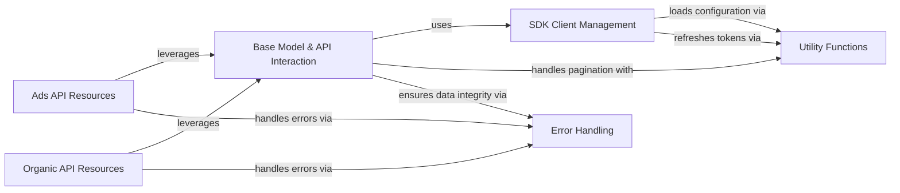

## Component Details

The Core SDK Services component provides the foundational services for the Pinterest Python SDK. This includes client initialization, authentication, configuration loading, base model functionalities for API interactions, error handling, and pagination. It forms the backbone for all other API-specific management components, enabling seamless interaction with both Ads and Organic Pinterest APIs.

### SDK Client Management
This component is responsible for initializing and managing the Pinterest API client. It handles the creation of default clients, clients with specific access tokens, and manages the configuration and access token retrieval processes, including refreshing expired tokens.

**Related Classes/Methods**:

- `pinterest.client.PinterestSDKClient` (full file reference)
- `pinterest.client.PinterestSDKClient.__init__` (full file reference)
- `pinterest.client.PinterestSDKClient.create_client_with_refresh_token` (full file reference)
- `pinterest.client.PinterestSDKClient.create_client_with_token` (full file reference)
- `pinterest.client.PinterestSDKClient.set_default_access_token` (full file reference)
- `pinterest.client.PinterestSDKClient.set_default_refresh_token` (full file reference)
- `pinterest.client.PinterestSDKClient.create_default_client` (full file reference)
- `pinterest.client.PinterestSDKClient._init_default_sdk_client_from_env` (full file reference)
- `pinterest.client.PinterestSDKClient._get_access_token` (full file reference)
- `pinterest.client.PinterestSDKClient._get_config` (full file reference)
- `pinterest.client.PinterestSDKClient._reset_default_client` (full file reference)
- `pinterest.client.PinterestSDKClient._set_default_client` (full file reference)

### Base Model & API Interaction
This component provides the foundational methods for interacting with the Pinterest API. It defines common operations like creating, listing, and updating resources, and manages the retrieval of the API client and API instance for specific resource interactions. It also includes methods for populating fields from API responses.

**Related Classes/Methods**:

- <a href="https://github.com/pinterest/pinterest-python-sdk/blob/master/pinterest/utils/base_model.py#L15-L213" target="_blank" rel="noopener noreferrer">`pinterest.utils.base_model.PinterestBaseModel` (15:213)</a>
- <a href="https://github.com/pinterest/pinterest-python-sdk/blob/master/pinterest/utils/base_model.py#L20-L41" target="_blank" rel="noopener noreferrer">`pinterest.utils.base_model.PinterestBaseModel.__init__` (20:41)</a>
- <a href="https://github.com/pinterest/pinterest-python-sdk/blob/master/pinterest/utils/base_model.py#L87-L90" target="_blank" rel="noopener noreferrer">`pinterest.utils.base_model.PinterestBaseModel._get_client` (87:90)</a>
- <a href="https://github.com/pinterest/pinterest-python-sdk/blob/master/pinterest/utils/base_model.py#L93-L98" target="_blank" rel="noopener noreferrer">`pinterest.utils.base_model.PinterestBaseModel._get_api_instance` (93:98)</a>
- <a href="https://github.com/pinterest/pinterest-python-sdk/blob/master/pinterest/utils/base_model.py#L111-L163" target="_blank" rel="noopener noreferrer">`pinterest.utils.base_model.PinterestBaseModel._list` (111:163)</a>
- <a href="https://github.com/pinterest/pinterest-python-sdk/blob/master/pinterest/utils/base_model.py#L166-L183" target="_blank" rel="noopener noreferrer">`pinterest.utils.base_model.PinterestBaseModel._create` (166:183)</a>
- <a href="https://github.com/pinterest/pinterest-python-sdk/blob/master/pinterest/utils/base_model.py#L185-L213" target="_blank" rel="noopener noreferrer">`pinterest.utils.base_model.PinterestBaseModel._update` (185:213)</a>
- <a href="https://github.com/pinterest/pinterest-python-sdk/blob/master/pinterest/utils/base_model.py#L52-L81" target="_blank" rel="noopener noreferrer">`pinterest.utils.base_model.PinterestBaseModel._populate_fields` (52:81)</a>

### Error Handling
This component is responsible for verifying API responses and raising SDK-specific exceptions when errors occur during API interactions. It centralizes the error management logic for the SDK.

**Related Classes/Methods**:

- <a href="https://github.com/pinterest/pinterest-python-sdk/blob/master/pinterest/utils/error_handling.py#L6-L49" target="_blank" rel="noopener noreferrer">`pinterest.utils.error_handling.verify_api_response` (6:49)</a>
- <a href="https://github.com/pinterest/pinterest-python-sdk/blob/master/pinterest/utils/sdk_exceptions.py#L5-L28" target="_blank" rel="noopener noreferrer">`pinterest.utils.sdk_exceptions.SdkException` (5:28)</a>

### Utility Functions
This component provides various utility functions that support the SDK's operations. This includes managing bookmarks for pagination, refreshing access tokens, and loading configuration settings from JSON files.

**Related Classes/Methods**:

- <a href="https://github.com/pinterest/pinterest-python-sdk/blob/master/pinterest/utils/load_json_config.py#L13-L24" target="_blank" rel="noopener noreferrer">`pinterest.utils.load_json_config.load_json_config` (13:24)</a>
- <a href="https://github.com/pinterest/pinterest-python-sdk/blob/master/pinterest/utils/refresh_access_token.py#L12-L65" target="_blank" rel="noopener noreferrer">`pinterest.utils.refresh_access_token.get_new_access_token` (12:65)</a>
- <a href="https://github.com/pinterest/pinterest-python-sdk/blob/master/pinterest/utils/bookmark.py#L8-L61" target="_blank" rel="noopener noreferrer">`pinterest.utils.bookmark.Bookmark` (8:61)</a>
- <a href="https://github.com/pinterest/pinterest-python-sdk/blob/master/pinterest/utils/bookmark.py#L37-L52" target="_blank" rel="noopener noreferrer">`pinterest.utils.bookmark.Bookmark.get_next` (37:52)</a>

### Ads API Resources
This component encompasses all classes that represent specific resources within the Pinterest Ads API. These classes provide methods for creating, retrieving, updating, and managing various ad-related entities such as customer lists, ad groups, ads, keywords, audiences, conversion tags, campaigns, ad accounts, and conversion events. They leverage the Base Model for underlying API interactions.

**Related Classes/Methods**:

- <a href="https://github.com/pinterest/pinterest-python-sdk/blob/master/pinterest/ads/customer_lists.py#L19-L283" target="_blank" rel="noopener noreferrer">`pinterest.ads.customer_lists.CustomerList` (19:283)</a>
- <a href="https://github.com/pinterest/pinterest-python-sdk/blob/master/pinterest/ads/customer_lists.py#L107-L170" target="_blank" rel="noopener noreferrer">`pinterest.ads.customer_lists.CustomerList.create` (107:170)</a>
- <a href="https://github.com/pinterest/pinterest-python-sdk/blob/master/pinterest/ads/customer_lists.py#L172-L191" target="_blank" rel="noopener noreferrer">`pinterest.ads.customer_lists.CustomerList.update_fields` (172:191)</a>
- <a href="https://github.com/pinterest/pinterest-python-sdk/blob/master/pinterest/ads/customer_lists.py#L194-L244" target="_blank" rel="noopener noreferrer">`pinterest.ads.customer_lists.CustomerList.get_all` (194:244)</a>
- <a href="https://github.com/pinterest/pinterest-python-sdk/blob/master/pinterest/ads/customer_lists.py#L246-L265" target="_blank" rel="noopener noreferrer">`pinterest.ads.customer_lists.CustomerList.add_record` (246:265)</a>
- <a href="https://github.com/pinterest/pinterest-python-sdk/blob/master/pinterest/ads/customer_lists.py#L267-L283" target="_blank" rel="noopener noreferrer">`pinterest.ads.customer_lists.CustomerList.remove_record` (267:283)</a>
- <a href="https://github.com/pinterest/pinterest-python-sdk/blob/master/pinterest/ads/ad_groups.py#L21-L499" target="_blank" rel="noopener noreferrer">`pinterest.ads.ad_groups.AdGroup` (21:499)</a>
- <a href="https://github.com/pinterest/pinterest-python-sdk/blob/master/pinterest/ads/ad_groups.py#L219-L351" target="_blank" rel="noopener noreferrer">`pinterest.ads.ad_groups.AdGroup.create` (219:351)</a>
- <a href="https://github.com/pinterest/pinterest-python-sdk/blob/master/pinterest/ads/ad_groups.py#L353-L380" target="_blank" rel="noopener noreferrer">`pinterest.ads.ad_groups.AdGroup.update_fields` (353:380)</a>
- <a href="https://github.com/pinterest/pinterest-python-sdk/blob/master/pinterest/ads/ad_groups.py#L383-L440" target="_blank" rel="noopener noreferrer">`pinterest.ads.ad_groups.AdGroup.get_all` (383:440)</a>
- <a href="https://github.com/pinterest/pinterest-python-sdk/blob/master/pinterest/ads/ad_groups.py#L481-L489" target="_blank" rel="noopener noreferrer">`pinterest.ads.ad_groups.AdGroup.enable_auto_targeting` (481:489)</a>
- <a href="https://github.com/pinterest/pinterest-python-sdk/blob/master/pinterest/ads/ad_groups.py#L491-L499" target="_blank" rel="noopener noreferrer">`pinterest.ads.ad_groups.AdGroup.disable_auto_targeting` (491:499)</a>
- <a href="https://github.com/pinterest/pinterest-python-sdk/blob/master/pinterest/ads/ads.py#L19-L444" target="_blank" rel="noopener noreferrer">`pinterest.ads.ads.Ad` (19:444)</a>
- <a href="https://github.com/pinterest/pinterest-python-sdk/blob/master/pinterest/ads/ads.py#L239-L339" target="_blank" rel="noopener noreferrer">`pinterest.ads.ads.Ad.create` (239:339)</a>
- <a href="https://github.com/pinterest/pinterest-python-sdk/blob/master/pinterest/ads/ads.py#L342-L418" target="_blank" rel="noopener noreferrer">`pinterest.ads.ads.Ad.get_all` (342:418)</a>
- <a href="https://github.com/pinterest/pinterest-python-sdk/blob/master/pinterest/ads/ads.py#L420-L444" target="_blank" rel="noopener noreferrer">`pinterest.ads.ads.Ad.update_fields` (420:444)</a>
- <a href="https://github.com/pinterest/pinterest-python-sdk/blob/master/pinterest/ads/keywords.py#L20-L230" target="_blank" rel="noopener noreferrer">`pinterest.ads.keywords.Keyword` (20:230)</a>
- <a href="https://github.com/pinterest/pinterest-python-sdk/blob/master/pinterest/ads/keywords.py#L89-L153" target="_blank" rel="noopener noreferrer">`pinterest.ads.keywords.Keyword.create` (89:153)</a>
- <a href="https://github.com/pinterest/pinterest-python-sdk/blob/master/pinterest/ads/keywords.py#L156-L205" target="_blank" rel="noopener noreferrer">`pinterest.ads.keywords.Keyword.get_all` (156:205)</a>
- <a href="https://github.com/pinterest/pinterest-python-sdk/blob/master/pinterest/ads/keywords.py#L207-L230" target="_blank" rel="noopener noreferrer">`pinterest.ads.keywords.Keyword.update_fields` (207:230)</a>
- <a href="https://github.com/pinterest/pinterest-python-sdk/blob/master/pinterest/ads/audiences.py#L23-L275" target="_blank" rel="noopener noreferrer">`pinterest.ads.audiences.Audience` (23:275)</a>
- <a href="https://github.com/pinterest/pinterest-python-sdk/blob/master/pinterest/ads/audiences.py#L108-L189" target="_blank" rel="noopener noreferrer">`pinterest.ads.audiences.Audience.create` (108:189)</a>
- <a href="https://github.com/pinterest/pinterest-python-sdk/blob/master/pinterest/ads/audiences.py#L192-L251" target="_blank" rel="noopener noreferrer">`pinterest.ads.audiences.Audience.get_all` (192:251)</a>
- <a href="https://github.com/pinterest/pinterest-python-sdk/blob/master/pinterest/ads/audiences.py#L253-L275" target="_blank" rel="noopener noreferrer">`pinterest.ads.audiences.Audience.update_fields` (253:275)</a>
- <a href="https://github.com/pinterest/pinterest-python-sdk/blob/master/pinterest/ads/conversion_tags.py#L20-L314" target="_blank" rel="noopener noreferrer">`pinterest.ads.conversion_tags.ConversionTag` (20:314)</a>
- <a href="https://github.com/pinterest/pinterest-python-sdk/blob/master/pinterest/ads/conversion_tags.py#L108-L198" target="_blank" rel="noopener noreferrer">`pinterest.ads.conversion_tags.ConversionTag.create` (108:198)</a>
- <a href="https://github.com/pinterest/pinterest-python-sdk/blob/master/pinterest/ads/conversion_tags.py#L201-L236" target="_blank" rel="noopener noreferrer">`pinterest.ads.conversion_tags.ConversionTag.get_all` (201:236)</a>
- <a href="https://github.com/pinterest/pinterest-python-sdk/blob/master/pinterest/ads/conversion_tags.py#L239-L278" target="_blank" rel="noopener noreferrer">`pinterest.ads.conversion_tags.ConversionTag.get_page_visit_conversion_tag_events` (239:278)</a>
- <a href="https://github.com/pinterest/pinterest-python-sdk/blob/master/pinterest/ads/conversion_tags.py#L281-L314" target="_blank" rel="noopener noreferrer">`pinterest.ads.conversion_tags.ConversionTag.get_ocpm_eligible_conversion_tag_events` (281:314)</a>
- <a href="https://github.com/pinterest/pinterest-python-sdk/blob/master/pinterest/ads/campaigns.py#L21-L541" target="_blank" rel="noopener noreferrer">`pinterest.ads.campaigns.Campaign` (21:541)</a>
- <a href="https://github.com/pinterest/pinterest-python-sdk/blob/master/pinterest/ads/campaigns.py#L159-L300" target="_blank" rel="noopener noreferrer">`pinterest.ads.campaigns.Campaign.create` (159:300)</a>
- <a href="https://github.com/pinterest/pinterest-python-sdk/blob/master/pinterest/ads/campaigns.py#L303-L365" target="_blank" rel="noopener noreferrer">`pinterest.ads.campaigns.Campaign.get_all` (303:365)</a>
- <a href="https://github.com/pinterest/pinterest-python-sdk/blob/master/pinterest/ads/campaigns.py#L367-L389" target="_blank" rel="noopener noreferrer">`pinterest.ads.campaigns.Campaign.set_lifetime_budget` (367:389)</a>
- <a href="https://github.com/pinterest/pinterest-python-sdk/blob/master/pinterest/ads/campaigns.py#L391-L413" target="_blank" rel="noopener noreferrer">`pinterest.ads.campaigns.Campaign.set_daily_budget` (391:413)</a>
- <a href="https://github.com/pinterest/pinterest-python-sdk/blob/master/pinterest/ads/campaigns.py#L433-L459" target="_blank" rel="noopener noreferrer">`pinterest.ads.campaigns.Campaign._change_status` (433:459)</a>
- <a href="https://github.com/pinterest/pinterest-python-sdk/blob/master/pinterest/ads/campaigns.py#L461-L468" target="_blank" rel="noopener noreferrer">`pinterest.ads.campaigns.Campaign.pause` (461:468)</a>
- <a href="https://github.com/pinterest/pinterest-python-sdk/blob/master/pinterest/ads/campaigns.py#L470-L477" target="_blank" rel="noopener noreferrer">`pinterest.ads.campaigns.Campaign.activate` (470:477)</a>
- <a href="https://github.com/pinterest/pinterest-python-sdk/blob/master/pinterest/ads/campaigns.py#L479-L486" target="_blank" rel="noopener noreferrer">`pinterest.ads.campaigns.Campaign.archive` (479:486)</a>
- <a href="https://github.com/pinterest/pinterest-python-sdk/blob/master/pinterest/ads/campaigns.py#L488-L512" target="_blank" rel="noopener noreferrer">`pinterest.ads.campaigns.Campaign.update_fields` (488:512)</a>
- <a href="https://github.com/pinterest/pinterest-python-sdk/blob/master/pinterest/ads/ad_accounts.py#L22-L262" target="_blank" rel="noopener noreferrer">`pinterest.ads.ad_accounts.AdAccount` (22:262)</a>
- <a href="https://github.com/pinterest/pinterest-python-sdk/blob/master/pinterest/ads/ad_accounts.py#L102-L145" target="_blank" rel="noopener noreferrer">`pinterest.ads.ad_accounts.AdAccount.create` (102:145)</a>
- <a href="https://github.com/pinterest/pinterest-python-sdk/blob/master/pinterest/ads/conversion_events.py#L16-L119" target="_blank" rel="noopener noreferrer">`pinterest.ads.conversion_events.Conversion` (16:119)</a>
- <a href="https://github.com/pinterest/pinterest-python-sdk/blob/master/pinterest/ads/conversion_events.py#L96-L119" target="_blank" rel="noopener noreferrer">`pinterest.ads.conversion_events.Conversion.send_conversion_events` (96:119)</a>

### Organic API Resources
This component includes all classes that represent specific resources within the Pinterest Organic API. These classes provide methods for creating, retrieving, updating, and deleting organic entities such as boards, board sections, and pins. They also rely on the Base Model for core API interactions.

**Related Classes/Methods**:

- <a href="https://github.com/pinterest/pinterest-python-sdk/blob/master/pinterest/organic/boards.py#L22-L189" target="_blank" rel="noopener noreferrer">`pinterest.organic.boards.BoardSection` (22:189)</a>
- <a href="https://github.com/pinterest/pinterest-python-sdk/blob/master/pinterest/organic/boards.py#L52-L80" target="_blank" rel="noopener noreferrer">`pinterest.organic.boards.BoardSection.create` (52:80)</a>
- <a href="https://github.com/pinterest/pinterest-python-sdk/blob/master/pinterest/organic/boards.py#L84-L128" target="_blank" rel="noopener noreferrer">`pinterest.organic.boards.BoardSection.get_all` (84:128)</a>
- <a href="https://github.com/pinterest/pinterest-python-sdk/blob/master/pinterest/organic/boards.py#L131-L162" target="_blank" rel="noopener noreferrer">`pinterest.organic.boards.BoardSection.update` (131:162)</a>
- <a href="https://github.com/pinterest/pinterest-python-sdk/blob/master/pinterest/organic/boards.py#L165-L189" target="_blank" rel="noopener noreferrer">`pinterest.organic.boards.BoardSection.delete` (165:189)</a>
- <a href="https://github.com/pinterest/pinterest-python-sdk/blob/master/pinterest/organic/boards.py#L192-L605" target="_blank" rel="noopener noreferrer">`pinterest.organic.boards.Board` (192:605)</a>
- <a href="https://github.com/pinterest/pinterest-python-sdk/blob/master/pinterest/organic/boards.py#L292-L331" target="_blank" rel="noopener noreferrer">`pinterest.organic.boards.Board.create` (292:331)</a>
- <a href="https://github.com/pinterest/pinterest-python-sdk/blob/master/pinterest/organic/boards.py#L334-L359" target="_blank" rel="noopener noreferrer">`pinterest.organic.boards.Board.delete` (334:359)</a>
- <a href="https://github.com/pinterest/pinterest-python-sdk/blob/master/pinterest/organic/boards.py#L362-L416" target="_blank" rel="noopener noreferrer">`pinterest.organic.boards.Board.get_all` (362:416)</a>
- <a href="https://github.com/pinterest/pinterest-python-sdk/blob/master/pinterest/organic/boards.py#L418-L443" target="_blank" rel="noopener noreferrer">`pinterest.organic.boards.Board.update_fields` (418:443)</a>
- <a href="https://github.com/pinterest/pinterest-python-sdk/blob/master/pinterest/organic/boards.py#L445-L452" target="_blank" rel="noopener noreferrer">`pinterest.organic.boards.Board.make_public` (445:452)</a>
- <a href="https://github.com/pinterest/pinterest-python-sdk/blob/master/pinterest/organic/boards.py#L454-L461" target="_blank" rel="noopener noreferrer">`pinterest.organic.boards.Board.make_secret` (454:461)</a>
- <a href="https://github.com/pinterest/pinterest-python-sdk/blob/master/pinterest/organic/boards.py#L556-L605" target="_blank" rel="noopener noreferrer">`pinterest.organic.boards.Board.list_pins` (556:605)</a>
- <a href="https://github.com/pinterest/pinterest-python-sdk/blob/master/pinterest/organic/pins.py#L16-L392" target="_blank" rel="noopener noreferrer">`pinterest.organic.pins.Pin` (16:392)</a>
- <a href="https://github.com/pinterest/pinterest-python-sdk/blob/master/pinterest/organic/pins.py#L179-L258" target="_blank" rel="noopener noreferrer">`pinterest.organic.pins.Pin.create` (179:258)</a>
- <a href="https://github.com/pinterest/pinterest-python-sdk/blob/master/pinterest/organic/pins.py#L261-L286" target="_blank" rel="noopener noreferrer">`pinterest.organic.pins.Pin.delete` (261:286)</a>
- <a href="https://github.com/pinterest/pinterest-python-sdk/blob/master/pinterest/organic/pins.py#L288-L315" target="_blank" rel="noopener noreferrer">`pinterest.organic.pins.Pin.save` (288:315)</a>
- <a href="https://github.com/pinterest/pinterest-python-sdk/blob/master/pinterest/organic/pins.py#L318-L392" target="_blank" rel="noopener noreferrer">`pinterest.organic.pins.Pin.get_all` (318:392)</a>

### [FAQ](https://github.com/CodeBoarding/GeneratedOnBoardings/tree/main?tab=readme-ov-file#faq)