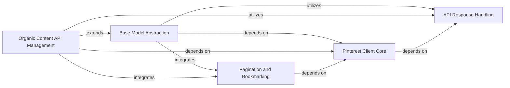

## Component Details

This architecture outlines the core components of the Pinterest Python SDK, focusing on how it manages client connections, handles API interactions, and provides structured access to organic content like boards and pins. The Pinterest Client Core establishes the fundamental connection, while the Base Model Abstraction provides a standardized interface for all API resources. API Response Handling ensures robust error management, and Pagination and Bookmarking facilitates efficient data retrieval. The Organic Content API Management component specifically leverages these core services to offer comprehensive functionalities for managing Pinterest organic content.

### Pinterest Client Core

Manages the fundamental aspects of the Pinterest SDK client, including client creation, configuration, and access token handling. It serves as the entry point for establishing a connection to the Pinterest API.

**Related Classes/Methods**:

- `pinterest-python-sdk.pinterest.client.PinterestSDKClient` (full file reference)

- `pinterest-python-sdk.pinterest.client.PinterestSDKClient.__init__` (full file reference)

- `pinterest-python-sdk.pinterest.client.PinterestSDKClient.create_default_client` (full file reference)

- `pinterest-python-sdk.pinterest.client.PinterestSDKClient._init_default_sdk_client_from_env` (full file reference)

- `pinterest-python-sdk.pinterest.client.PinterestSDKClient._get_config` (full file reference)

- `pinterest-python-sdk.pinterest.client.PinterestSDKClient._get_access_token` (full file reference)

- `pinterest-python-sdk.pinterest.client.PinterestSDKClient._set_default_client` (full file reference)

- <a href="https://github.com/pinterest/pinterest-python-sdk/blob/master/pinterest/utils/refresh_access_token.py#L12-L65" target="_blank" rel="noopener noreferrer">`pinterest.utils.refresh_access_token.get_new_access_token` (12:65)</a>

### Base Model Abstraction

Provides a generic base for all Pinterest API models, encapsulating common functionalities like client and API instance retrieval, and standardized methods for listing, creating, and updating resources. It handles the population of model attributes from API responses.

**Related Classes/Methods**:

- <a href="https://github.com/pinterest/pinterest-python-sdk/blob/master/pinterest/utils/base_model.py#L15-L213" target="_blank" rel="noopener noreferrer">`pinterest-python-sdk.pinterest.utils.base_model.PinterestBaseModel` (15:213)</a>

- <a href="https://github.com/pinterest/pinterest-python-sdk/blob/master/pinterest/utils/base_model.py#L20-L41" target="_blank" rel="noopener noreferrer">`pinterest-python-sdk.pinterest.utils.base_model.PinterestBaseModel.__init__` (20:41)</a>

- <a href="https://github.com/pinterest/pinterest-python-sdk/blob/master/pinterest/utils/base_model.py#L87-L90" target="_blank" rel="noopener noreferrer">`pinterest-python-sdk.pinterest.utils.base_model.PinterestBaseModel._get_client` (87:90)</a>

- <a href="https://github.com/pinterest/pinterest-python-sdk/blob/master/pinterest/utils/base_model.py#L93-L98" target="_blank" rel="noopener noreferrer">`pinterest-python-sdk.pinterest.utils.base_model.PinterestBaseModel._get_api_instance` (93:98)</a>

- <a href="https://github.com/pinterest/pinterest-python-sdk/blob/master/pinterest/utils/base_model.py#L101-L108" target="_blank" rel="noopener noreferrer">`pinterest-python-sdk.pinterest.utils.base_model.PinterestBaseModel._call_method` (101:108)</a>

- <a href="https://github.com/pinterest/pinterest-python-sdk/blob/master/pinterest/utils/base_model.py#L111-L163" target="_blank" rel="noopener noreferrer">`pinterest-python-sdk.pinterest.utils.base_model.PinterestBaseModel._list` (111:163)</a>

- <a href="https://github.com/pinterest/pinterest-python-sdk/blob/master/pinterest/utils/base_model.py#L166-L183" target="_blank" rel="noopener noreferrer">`pinterest-python-sdk.pinterest.utils.base_model.PinterestBaseModel._create` (166:183)</a>

- <a href="https://github.com/pinterest/pinterest-python-sdk/blob/master/pinterest/utils/base_model.py#L185-L213" target="_blank" rel="noopener noreferrer">`pinterest-python-sdk.pinterest.utils.base_model.PinterestBaseModel._update` (185:213)</a>

- <a href="https://github.com/pinterest/pinterest-python-sdk/blob/master/pinterest/utils/base_model.py#L52-L81" target="_blank" rel="noopener noreferrer">`pinterest-python-sdk.pinterest.utils.base_model.PinterestBaseModel._populate_fields` (52:81)</a>

### API Response Handling

Centralized component for validating API responses and managing SDK-specific exceptions, ensuring robust error handling across the SDK.

**Related Classes/Methods**:

- <a href="https://github.com/pinterest/pinterest-python-sdk/blob/master/pinterest/utils/error_handling.py#L6-L49" target="_blank" rel="noopener noreferrer">`pinterest-python-sdk.pinterest.utils.error_handling.verify_api_response` (6:49)</a>

- <a href="https://github.com/pinterest/pinterest-python-sdk/blob/master/pinterest/utils/sdk_exceptions.py#L5-L28" target="_blank" rel="noopener noreferrer">`pinterest.utils.sdk_exceptions.SdkException` (5:28)</a>

### Organic Content API Management

Provides functionalities for managing organic content on Pinterest, including boards, board sections, and pins. It relies on the Core SDK Services for interacting with the Pinterest API.

**Related Classes/Methods**:

- <a href="https://github.com/pinterest/pinterest-python-sdk/blob/master/pinterest/organic/boards.py#L192-L605" target="_blank" rel="noopener noreferrer">`pinterest.organic.boards.Board` (192:605)</a>

- <a href="https://github.com/pinterest/pinterest-python-sdk/blob/master/pinterest/organic/boards.py#L196-L231" target="_blank" rel="noopener noreferrer">`pinterest.organic.boards.Board.__init__` (196:231)</a>

- <a href="https://github.com/pinterest/pinterest-python-sdk/blob/master/pinterest/organic/boards.py#L292-L331" target="_blank" rel="noopener noreferrer">`pinterest.organic.boards.Board.create` (292:331)</a>

- <a href="https://github.com/pinterest/pinterest-python-sdk/blob/master/pinterest/organic/boards.py#L334-L359" target="_blank" rel="noopener noreferrer">`pinterest.organic.boards.Board.delete` (334:359)</a>

- <a href="https://github.com/pinterest/pinterest-python-sdk/blob/master/pinterest/organic/boards.py#L362-L416" target="_blank" rel="noopener noreferrer">`pinterest.organic.boards.Board.get_all` (362:416)</a>

- <a href="https://github.com/pinterest/pinterest-python-sdk/blob/master/pinterest/organic/boards.py#L418-L443" target="_blank" rel="noopener noreferrer">`pinterest.organic.boards.Board.update_fields` (418:443)</a>

- <a href="https://github.com/pinterest/pinterest-python-sdk/blob/master/pinterest/organic/boards.py#L445-L452" target="_blank" rel="noopener noreferrer">`pinterest.organic.boards.Board.make_public` (445:452)</a>

- <a href="https://github.com/pinterest/pinterest-python-sdk/blob/master/pinterest/organic/boards.py#L454-L461" target="_blank" rel="noopener noreferrer">`pinterest.organic.boards.Board.make_secret` (454:461)</a>

- <a href="https://github.com/pinterest/pinterest-python-sdk/blob/master/pinterest/organic/boards.py#L463-L480" target="_blank" rel="noopener noreferrer">`pinterest.organic.boards.Board.create_section` (463:480)</a>

- <a href="https://github.com/pinterest/pinterest-python-sdk/blob/master/pinterest/organic/boards.py#L482-L501" target="_blank" rel="noopener noreferrer">`pinterest.organic.boards.Board.update_section` (482:501)</a>

- <a href="https://github.com/pinterest/pinterest-python-sdk/blob/master/pinterest/organic/boards.py#L503-L520" target="_blank" rel="noopener noreferrer">`pinterest.organic.boards.Board.delete_section` (503:520)</a>

- <a href="https://github.com/pinterest/pinterest-python-sdk/blob/master/pinterest/organic/boards.py#L522-L554" target="_blank" rel="noopener noreferrer">`pinterest.organic.boards.Board.list_sections` (522:554)</a>

- <a href="https://github.com/pinterest/pinterest-python-sdk/blob/master/pinterest/organic/boards.py#L556-L605" target="_blank" rel="noopener noreferrer">`pinterest.organic.boards.Board.list_pins` (556:605)</a>

- <a href="https://github.com/pinterest/pinterest-python-sdk/blob/master/pinterest/organic/boards.py#L52-L80" target="_blank" rel="noopener noreferrer">`pinterest.organic.boards.BoardSection.create` (52:80)</a>

- <a href="https://github.com/pinterest/pinterest-python-sdk/blob/master/pinterest/organic/boards.py#L84-L128" target="_blank" rel="noopener noreferrer">`pinterest.organic.boards.BoardSection.get_all` (84:128)</a>

- <a href="https://github.com/pinterest/pinterest-python-sdk/blob/master/pinterest/organic/boards.py#L131-L162" target="_blank" rel="noopener noreferrer">`pinterest.organic.boards.BoardSection.update` (131:162)</a>

- <a href="https://github.com/pinterest/pinterest-python-sdk/blob/master/pinterest/organic/boards.py#L165-L189" target="_blank" rel="noopener noreferrer">`pinterest.organic.boards.BoardSection.delete` (165:189)</a>

- <a href="https://github.com/pinterest/pinterest-python-sdk/blob/master/pinterest/organic/pins.py#L16-L392" target="_blank" rel="noopener noreferrer">`pinterest.organic.pins.Pin` (16:392)</a>

- <a href="https://github.com/pinterest/pinterest-python-sdk/blob/master/pinterest/organic/pins.py#L20-L78" target="_blank" rel="noopener noreferrer">`pinterest.organic.pins.Pin.__init__` (20:78)</a>

- <a href="https://github.com/pinterest/pinterest-python-sdk/blob/master/pinterest/organic/pins.py#L179-L258" target="_blank" rel="noopener noreferrer">`pinterest.organic.pins.Pin.create` (179:258)</a>

- <a href="https://github.com/pinterest/pinterest-python-sdk/blob/master/pinterest/organic/pins.py#L261-L286" target="_blank" rel="noopener noreferrer">`pinterest.organic.pins.Pin.delete` (261:286)</a>

- <a href="https://github.com/pinterest/pinterest-python-sdk/blob/master/pinterest/organic/pins.py#L288-L315" target="_blank" rel="noopener noreferrer">`pinterest.organic.pins.Pin.save` (288:315)</a>

- <a href="https://github.com/pinterest/pinterest-python-sdk/blob/master/pinterest/organic/pins.py#L318-L392" target="_blank" rel="noopener noreferrer">`pinterest.organic.pins.Pin.get_all` (318:392)</a>

### Pagination and Bookmarking

Provides utility for handling pagination and bookmarking mechanisms in API responses, enabling efficient retrieval of large datasets.

**Related Classes/Methods**:

- <a href="https://github.com/pinterest/pinterest-python-sdk/blob/master/pinterest/utils/bookmark.py#L8-L61" target="_blank" rel="noopener noreferrer">`pinterest.utils.bookmark.Bookmark` (8:61)</a>

### [FAQ](https://github.com/CodeBoarding/GeneratedOnBoardings/tree/main?tab=readme-ov-file#faq)