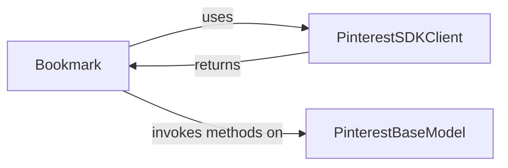

## Details

The `Pagination Utility` component, primarily embodied by the `Bookmark` class, is crucial for handling paginated API responses within the Pinterest Python SDK. It abstracts away the complexities of managing pagination tokens, allowing users to seamlessly iterate through large datasets.

### Bookmark

This is the core component of the pagination utility. It encapsulates the state and logic required to fetch subsequent pages of data from paginated API endpoints. It stores the `bookmark_token` (the pagination cursor), a reference to the `model` (the SDK model instance on which the paginated function was initially called), the `model_fn` (the name of the method on the `model` that retrieves paginated data), and `model_fn_args` (the arguments to be passed to `model_fn`). It uses the `PinterestSDKClient` to execute the actual API calls for fetching the next page.

**Related Classes/Methods**:

- <a href="https://github.com/pinterest/pinterest-python-sdk/blob/main/pinterest/utils/bookmark.py" target="_blank" rel="noopener noreferrer">`Bookmark`</a>

- <a href="https://github.com/pinterest/pinterest-python-sdk/blob/main/pinterest/utils/bookmark.py" target="_blank" rel="noopener noreferrer">`Bookmark:get_next`</a>

### PinterestSDKClient

This is the main client responsible for all interactions with the Pinterest API. The `Bookmark` component holds a reference to an instance of `PinterestSDKClient` and uses it to make the underlying HTTP requests when `get_next()` is invoked. This ensures that all API calls, including those for pagination, are routed through the central client, adhering to authentication and configuration settings.

**Related Classes/Methods**:

- `PinterestSDKClient`

### PinterestBaseModel

This represents the base class for various data models within the SDK (e.g., models for Ads, Organic content). When a paginated list operation is performed on an SDK model (which internally uses the `PinterestSDKClient`), an instance of that model (or the class itself) is passed to the `Bookmark` object along with the method name (`model_fn`). The `Bookmark` then uses this `model` and `model_fn` to dynamically call the appropriate method to retrieve the next page of results.

**Related Classes/Methods**:

- `PinterestBaseModel`

### [FAQ](https://github.com/CodeBoarding/GeneratedOnBoardings/tree/main?tab=readme-ov-file#faq)