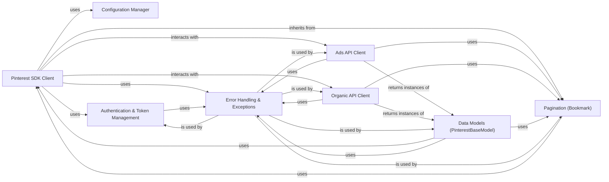

## Details

These components are fundamental to the Pinterest Python SDK for the following reasons, aligning with typical SDK/Client Library patterns: The `Pinterest SDK Client` is the absolute core, acting as a Facade and the first point of interaction. The `Configuration Manager` centralizes SDK settings. `Ads API Client` and `Organic API Client` provide modular, domain-specific interfaces. `Data Models (PinterestBaseModel)` offer structured data representation. `Authentication & Token Management` handles secure API access. `Error Handling & Exceptions` provides clear error reporting. `Pagination (Bookmark)` enables efficient retrieval of large datasets.

### Pinterest SDK Client [[Expand]](./Pinterest_SDK_Client.md)

The central entry point and orchestrator of the SDK. It is responsible for initializing the client, managing API authentication (access tokens), and providing the underlying HTTP client for all API requests. It acts as the primary interface for users to interact with the Pinterest API, delegating specific domain requests to the `Ads API Client` and `Organic API Client`. It also directly handles pagination logic by inheriting from `Pagination (Bookmark)`.

**Related Classes/Methods**:

- `pinterest.client.PinterestSDKClient`

### Configuration Manager

Responsible for loading, parsing, and managing SDK configuration settings, such as API keys, environment (e.g., production, sandbox), and other global parameters required for API connectivity. It ensures the SDK operates with the correct settings.

**Related Classes/Methods**:

- <a href="https://github.com/pinterest/pinterest-python-sdk/blob/main/pinterest/config.py" target="_blank" rel="noopener noreferrer">`pinterest.config`</a>

- <a href="https://github.com/pinterest/pinterest-python-sdk/blob/main/pinterest/bin/get_config.py" target="_blank" rel="noopener noreferrer">`pinterest.bin.get_config`</a>

- <a href="https://github.com/pinterest/pinterest-python-sdk/blob/main/pinterest/utils/load_json_config.py" target="_blank" rel="noopener noreferrer">`pinterest.utils.load_json_config`</a>

### Ads API Client

A comprehensive collection of modules and classes dedicated to interacting with the Pinterest Ads API. It encapsulates the logic for managing ad accounts, campaigns, ad groups, ads, audiences, and other advertising-related entities, providing a structured interface for ad operations.

**Related Classes/Methods**:

- <a href="https://github.com/pinterest/pinterest-python-sdk/blob/main/pinterest/ads/ad_accounts.py" target="_blank" rel="noopener noreferrer">`pinterest.ads.ad_accounts`</a>

- <a href="https://github.com/pinterest/pinterest-python-sdk/blob/main/pinterest/ads/ad_groups.py" target="_blank" rel="noopener noreferrer">`pinterest.ads.ad_groups`</a>

- <a href="https://github.com/pinterest/pinterest-python-sdk/blob/main/pinterest/ads/ads.py" target="_blank" rel="noopener noreferrer">`pinterest.ads.ads`</a>

- <a href="https://github.com/pinterest/pinterest-python-sdk/blob/main/pinterest/ads/audiences.py" target="_blank" rel="noopener noreferrer">`pinterest.ads.audiences`</a>

- <a href="https://github.com/pinterest/pinterest-python-sdk/blob/main/pinterest/ads/campaigns.py" target="_blank" rel="noopener noreferrer">`pinterest.ads.campaigns`</a>

- <a href="https://github.com/pinterest/pinterest-python-sdk/blob/main/pinterest/ads/conversion_events.py" target="_blank" rel="noopener noreferrer">`pinterest.ads.conversion_events`</a>

- <a href="https://github.com/pinterest/pinterest-python-sdk/blob/main/pinterest/ads/conversion_tags.py" target="_blank" rel="noopener noreferrer">`pinterest.ads.conversion_tags`</a>

- <a href="https://github.com/pinterest/pinterest-python-sdk/blob/main/pinterest/ads/customer_lists.py" target="_blank" rel="noopener noreferrer">`pinterest.ads.customer_lists`</a>

- <a href="https://github.com/pinterest/pinterest-python-sdk/blob/main/pinterest/ads/keywords.py" target="_blank" rel="noopener noreferrer">`pinterest.ads.keywords`</a>

### Organic API Client

A collection of modules and classes focused on interacting with the Pinterest Organic content API. It handles operations related to boards, pins, and other non-advertising content, providing methods for creating, retrieving, updating, and deleting organic entities.

**Related Classes/Methods**:

- <a href="https://github.com/pinterest/pinterest-python-sdk/blob/main/pinterest/organic/boards.py" target="_blank" rel="noopener noreferrer">`pinterest.organic.boards`</a>

- <a href="https://github.com/pinterest/pinterest-python-sdk/blob/main/pinterest/organic/pins.py" target="_blank" rel="noopener noreferrer">`pinterest.organic.pins`</a>

### Data Models (PinterestBaseModel)

The foundational base class for all data transfer objects (DTOs) or models representing entities returned by the Pinterest API. It provides a consistent structure, common methods for data manipulation, and potentially direct API interaction capabilities (e.g., fetching related data, handling pagination) for model instances.

**Related Classes/Methods**:

- <a href="https://github.com/pinterest/pinterest-python-sdk/blob/main/pinterest/utils/base_model.py" target="_blank" rel="noopener noreferrer">`pinterest.utils.base_model.PinterestBaseModel`</a>

### Authentication & Token Management

Manages the lifecycle of OAuth 2.0 access tokens, including their acquisition, storage, and automatic refreshing when they expire. This component ensures continuous and authenticated access to the Pinterest API without requiring manual token management from the user.

**Related Classes/Methods**:

- <a href="https://github.com/pinterest/pinterest-python-sdk/blob/main/pinterest/utils/refresh_access_token.py" target="_blank" rel="noopener noreferrer">`pinterest.utils.refresh_access_token`</a>

### Error Handling & Exceptions

Provides a standardized and centralized mechanism for handling and raising exceptions specific to the SDK. It defines custom exception types for various API errors and SDK-specific issues, ensuring robust error reporting and enabling graceful failure handling for developers.

**Related Classes/Methods**:

- <a href="https://github.com/pinterest/pinterest-python-sdk/blob/main/pinterest/utils/sdk_exceptions.py" target="_blank" rel="noopener noreferrer">`pinterest.utils.sdk_exceptions`</a>

- <a href="https://github.com/pinterest/pinterest-python-sdk/blob/main/pinterest/utils/error_handling.py" target="_blank" rel="noopener noreferrer">`pinterest.utils.error_handling`</a>

### Pagination (Bookmark)

Implements the logic for paginating through API responses, allowing the SDK to efficiently retrieve large datasets by managing continuation tokens or "bookmarks." This component provides the base functionality for iterative data retrieval.

**Related Classes/Methods**:

- <a href="https://github.com/pinterest/pinterest-python-sdk/blob/main/pinterest/utils/bookmark.py" target="_blank" rel="noopener noreferrer">`pinterest.utils.bookmark`</a>

### [FAQ](https://github.com/CodeBoarding/GeneratedOnBoardings/tree/main?tab=readme-ov-file#faq)