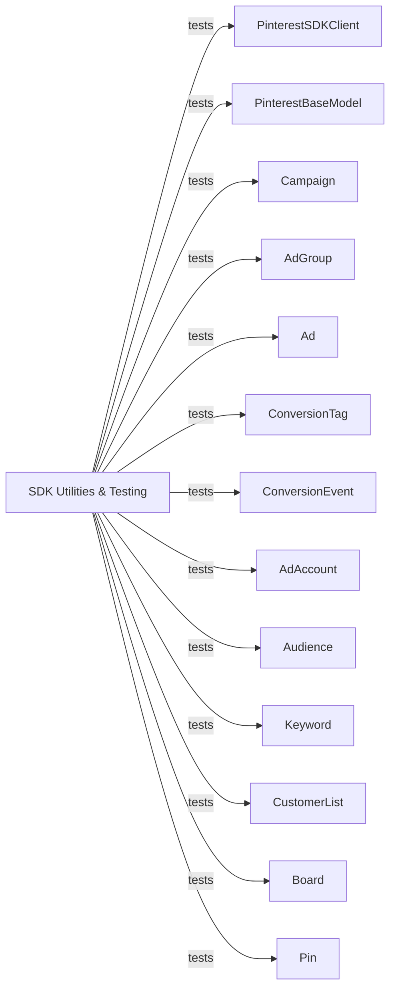

## Component Details

The SDK Utilities & Testing component serves a dual purpose: it provides a comprehensive suite of integration tests to validate the functionality and reliability of various Pinterest SDK components, ensuring that API interactions behave as expected. Additionally, it includes utility scripts crucial for the generation and management of documentation, streamlining the process of keeping the SDK's documentation up-to-date and accurate.

### SDK Utilities & Testing
Encompasses the integration test suite for validating SDK functionality and utility scripts for generating and managing documentation.

**Related Classes/Methods**:

- <a href="https://github.com/pinterest/pinterest-python-sdk/blob/master/integration_tests/clean_organic_data.py#L9-L25" target="_blank" rel="noopener noreferrer">`pinterest-python-sdk.integration_tests.clean_organic_data:test_delete_organic_data` (9:25)</a>
- <a href="https://github.com/pinterest/pinterest-python-sdk/blob/master/integration_tests/test_pinterest_base_model.py#L14-L27" target="_blank" rel="noopener noreferrer">`pinterest-python-sdk.integration_tests.test_pinterest_base_model.TestPinterestBaseModel:test_error_message_for_accessing_non_existant_attribute` (14:27)</a>
- <a href="https://github.com/pinterest/pinterest-python-sdk/blob/master/integration_tests/test_pinterest_base_model.py#L29-L47" target="_blank" rel="noopener noreferrer">`pinterest-python-sdk.integration_tests.test_pinterest_base_model.TestPinterestBaseModel:test_equality_of_campaign_models` (29:47)</a>
- <a href="https://github.com/pinterest/pinterest-python-sdk/blob/master/integration_tests/test_pinterest_base_model.py#L49-L60" target="_blank" rel="noopener noreferrer">`pinterest-python-sdk.integration_tests.test_pinterest_base_model.TestPinterestBaseModel:test_set_board_attributes_failure` (49:60)</a>
- <a href="https://github.com/pinterest/pinterest-python-sdk/blob/master/integration_tests/base_test.py#L41-L45" target="_blank" rel="noopener noreferrer">`pinterest-python-sdk.integration_tests.base_test.BaseTestCase:test_client` (41:45)</a>
- <a href="https://github.com/pinterest/pinterest-python-sdk/blob/master/integration_tests/ads/test_ads.py#L20-L38" target="_blank" rel="noopener noreferrer">`pinterest-python-sdk.integration_tests.ads.test_ads.TestCreateAd:test_create_ad_success` (20:38)</a>
- <a href="https://github.com/pinterest/pinterest-python-sdk/blob/master/integration_tests/ads/test_ads.py#L40-L54" target="_blank" rel="noopener noreferrer">`pinterest-python-sdk.integration_tests.ads.test_ads.TestCreateAd:test_create_ad_failure_without_creative_type` (40:54)</a>
- <a href="https://github.com/pinterest/pinterest-python-sdk/blob/master/integration_tests/ads/test_ads.py#L56-L71" target="_blank" rel="noopener noreferrer">`pinterest-python-sdk.integration_tests.ads.test_ads.TestCreateAd:test_create_ad_failure_with_incorrect_creative_type` (56:71)</a>
- <a href="https://github.com/pinterest/pinterest-python-sdk/blob/master/integration_tests/ads/test_ads.py#L77-L88" target="_blank" rel="noopener noreferrer">`pinterest-python-sdk.integration_tests.ads.test_ads.TestGetAd:test_get_ad_success` (77:88)</a>
- <a href="https://github.com/pinterest/pinterest-python-sdk/blob/master/integration_tests/ads/test_ads.py#L90-L102" target="_blank" rel="noopener noreferrer">`pinterest-python-sdk.integration_tests.ads.test_ads.TestGetAd:test_get_ad_fail_with_invalid_id` (90:102)</a>
- <a href="https://github.com/pinterest/pinterest-python-sdk/blob/master/integration_tests/ads/test_ads.py#L109-L122" target="_blank" rel="noopener noreferrer">`pinterest-python-sdk.integration_tests.ads.test_ads.TestGetListAd:test_get_all_success` (109:122)</a>
- <a href="https://github.com/pinterest/pinterest-python-sdk/blob/master/integration_tests/ads/test_ads.py#L124-L135" target="_blank" rel="noopener noreferrer">`pinterest-python-sdk.integration_tests.ads.test_ads.TestGetListAd:test_get_all_with_invalid_ids_fail` (124:135)</a>
- <a href="https://github.com/pinterest/pinterest-python-sdk/blob/master/integration_tests/ads/test_ads.py#L142-L162" target="_blank" rel="noopener noreferrer">`pinterest-python-sdk.integration_tests.ads.test_ads.TestUpdateAds:test_update_ad_success` (142:162)</a>
- <a href="https://github.com/pinterest/pinterest-python-sdk/blob/master/integration_tests/ads/test_conversion_tags.py#L15-L34" target="_blank" rel="noopener noreferrer">`pinterest-python-sdk.integration_tests.ads.test_conversion_tags.TestCreateConversionTag:test_create_conversion_tag_success` (15:34)</a>
- <a href="https://github.com/pinterest/pinterest-python-sdk/blob/master/integration_tests/ads/test_conversion_tags.py#L36-L56" target="_blank" rel="noopener noreferrer">`pinterest-python-sdk.integration_tests.ads.test_conversion_tags.TestCreateConversionTag:test_create_conversion_tag_with_configs_success` (36:56)</a>
- <a href="https://github.com/pinterest/pinterest-python-sdk/blob/master/integration_tests/ads/test_conversion_tags.py#L63-L76" target="_blank" rel="noopener noreferrer">`pinterest-python-sdk.integration_tests.ads.test_conversion_tags.TestGetConversionTag:test_get_conversion_tag_success` (63:76)</a>
- <a href="https://github.com/pinterest/pinterest-python-sdk/blob/master/integration_tests/ads/test_conversion_tags.py#L82-L102" target="_blank" rel="noopener noreferrer">`pinterest-python-sdk.integration_tests.ads.test_conversion_tags.TestGetListConversionTag:test_get_list_success` (82:102)</a>
- <a href="https://github.com/pinterest/pinterest-python-sdk/blob/master/integration_tests/ads/test_conversion_tags.py#L109-L118" target="_blank" rel="noopener noreferrer">`pinterest-python-sdk.integration_tests.ads.test_conversion_tags.TestGetPageVsitConversionTag:test_get_page_visit_success` (109:118)</a>
- <a href="https://github.com/pinterest/pinterest-python-sdk/blob/master/integration_tests/ads/test_conversion_tags.py#L124-L133" target="_blank" rel="noopener noreferrer">`pinterest-python-sdk.integration_tests.ads.test_conversion_tags.TestGetOcpmEligibleConversionTag:test_get_ocpm_eligible_conversion_tags` (124:133)</a>
- <a href="https://github.com/pinterest/pinterest-python-sdk/blob/master/integration_tests/ads/test_conversion_events.py#L21-L61" target="_blank" rel="noopener noreferrer">`pinterest-python-sdk.integration_tests.ads.test_conversion_events.TestSendConversionEvent:test_send_conversion_success` (21:61)</a>
- <a href="https://github.com/pinterest/pinterest-python-sdk/blob/master/integration_tests/ads/test_conversion_events.py#L63-L95" target="_blank" rel="noopener noreferrer">`pinterest-python-sdk.integration_tests.ads.test_conversion_events.TestSendConversionEvent:test_send_conversion_fail` (63:95)</a>
- <a href="https://github.com/pinterest/pinterest-python-sdk/blob/master/integration_tests/ads/test_campaigns.py#L24-L40" target="_blank" rel="noopener noreferrer">`pinterest-python-sdk.integration_tests.ads.test_campaigns.TestCreateCampaign:test_create_campaign_success` (24:40)</a>
- <a href="https://github.com/pinterest/pinterest-python-sdk/blob/master/integration_tests/ads/test_campaigns.py#L59-L71" target="_blank" rel="noopener noreferrer">`pinterest-python-sdk.integration_tests.ads.test_campaigns.TestCreateCampaign:test_create_campaign_failure_incorrect_objective_type` (59:71)</a>
- <a href="https://github.com/pinterest/pinterest-python-sdk/blob/master/integration_tests/ads/test_campaigns.py#L78-L92" target="_blank" rel="noopener noreferrer">`pinterest-python-sdk.integration_tests.ads.test_campaigns.TestGetCampaign:test_get_campaign_success` (78:92)</a>
- <a href="https://github.com/pinterest/pinterest-python-sdk/blob/master/integration_tests/ads/test_campaigns.py#L94-L106" target="_blank" rel="noopener noreferrer">`pinterest-python-sdk.integration_tests.ads.test_campaigns.TestGetCampaign:test_get_campaign_failure_invalid_campaign_id` (94:106)</a>
- <a href="https://github.com/pinterest/pinterest-python-sdk/blob/master/integration_tests/ads/test_campaigns.py#L113-L120" target="_blank" rel="noopener noreferrer">`pinterest-python-sdk.integration_tests.ads.test_campaigns.TestChangeCampaignStatus:test_pause_campaign_successfully` (113:120)</a>
- <a href="https://github.com/pinterest/pinterest-python-sdk/blob/master/integration_tests/ads/test_campaigns.py#L122-L129" target="_blank" rel="noopener noreferrer">`pinterest-python-sdk.integration_tests.ads.test_campaigns.TestChangeCampaignStatus:test_activate_campaign_successfully` (122:129)</a>
- <a href="https://github.com/pinterest/pinterest-python-sdk/blob/master/integration_tests/ads/test_campaigns.py#L131-L138" target="_blank" rel="noopener noreferrer">`pinterest-python-sdk.integration_tests.ads.test_campaigns.TestChangeCampaignStatus:test_archive_campaign_successfully` (131:138)</a>
- <a href="https://github.com/pinterest/pinterest-python-sdk/blob/master/integration_tests/ads/test_campaigns.py#L146-L170" target="_blank" rel="noopener noreferrer">`pinterest-python-sdk.integration_tests.ads.test_campaigns.TestGetAllCampaigns:test_get_all_campaigns` (146:170)</a>
- <a href="https://github.com/pinterest/pinterest-python-sdk/blob/master/integration_tests/ads/test_campaigns.py#L172-L201" target="_blank" rel="noopener noreferrer">`pinterest-python-sdk.integration_tests.ads.test_campaigns.TestGetAllCampaigns:test_list_ad_groups` (172:201)</a>
- <a href="https://github.com/pinterest/pinterest-python-sdk/blob/master/integration_tests/ads/test_campaigns.py#L203-L239" target="_blank" rel="noopener noreferrer">`pinterest-python-sdk.integration_tests.ads.test_campaigns.TestGetAllCampaigns:test_get_next_page_of_campaigns` (203:239)</a>
- <a href="https://github.com/pinterest/pinterest-python-sdk/blob/master/integration_tests/ads/test_ad_groups.py#L16-L38" target="_blank" rel="noopener noreferrer">`pinterest-python-sdk.integration_tests.ads.test_ad_groups.TestCreateAdGroup:test_create_ad_group_success` (16:38)</a>
- <a href="https://github.com/pinterest/pinterest-python-sdk/blob/master/integration_tests/ads/test_ad_groups.py#L40-L52" target="_blank" rel="noopener noreferrer">`pinterest-python-sdk.integration_tests.ads.test_ad_groups.TestCreateAdGroup:test_get_existing_ad_group` (40:52)</a>
- <a href="https://github.com/pinterest/pinterest-python-sdk/blob/master/integration_tests/ads/test_ad_groups.py#L59-L82" target="_blank" rel="noopener noreferrer">`pinterest-python-sdk.integration_tests.ads.test_ad_groups.TestUpdateAdGroup:test_update_success` (59:82)</a>
- <a href="https://github.com/pinterest/pinterest-python-sdk/blob/master/integration_tests/ads/test_ad_groups.py#L84-L107" target="_blank" rel="noopener noreferrer">`pinterest-python-sdk.integration_tests.ads.test_ad_groups.TestUpdateAdGroup:test_update_fail_with_invalid_tracking_urls` (84:107)</a>
- <a href="https://github.com/pinterest/pinterest-python-sdk/blob/master/integration_tests/ads/test_ad_groups.py#L114-L128" target="_blank" rel="noopener noreferrer">`pinterest-python-sdk.integration_tests.ads.test_ad_groups.TestGetListAdGroup:test_get_list_success` (114:128)</a>
- <a href="https://github.com/pinterest/pinterest-python-sdk/blob/master/integration_tests/ads/test_ad_groups.py#L130-L159" target="_blank" rel="noopener noreferrer">`pinterest-python-sdk.integration_tests.ads.test_ad_groups.TestGetListAdGroup:test_get_list_with_campaign_ids_success` (130:159)</a>
- <a href="https://github.com/pinterest/pinterest-python-sdk/blob/master/integration_tests/ads/test_ad_groups.py#L161-L172" target="_blank" rel="noopener noreferrer">`pinterest-python-sdk.integration_tests.ads.test_ad_groups.TestGetListAdGroup:test_get_list_invalid_id_fail` (161:172)</a>
- <a href="https://github.com/pinterest/pinterest-python-sdk/blob/master/integration_tests/ads/test_ad_groups.py#L179-L200" target="_blank" rel="noopener noreferrer">`pinterest-python-sdk.integration_tests.ads.test_ad_groups.TestListAds:test_list_ads_success` (179:200)</a>
- <a href="https://github.com/pinterest/pinterest-python-sdk/blob/master/integration_tests/ads/test_ad_groups.py#L202-L216" target="_blank" rel="noopener noreferrer">`pinterest-python-sdk.integration_tests.ads.test_ad_groups.TestListAds:test_enable_auto_targeting` (202:216)</a>
- <a href="https://github.com/pinterest/pinterest-python-sdk/blob/master/integration_tests/ads/test_ad_groups.py#L218-L232" target="_blank" rel="noopener noreferrer">`pinterest-python-sdk.integration_tests.ads.test_ad_groups.TestListAds:test_disable_auto_targeting` (218:232)</a>
- <a href="https://github.com/pinterest/pinterest-python-sdk/blob/master/integration_tests/ads/test_ad_accounts.py#L19-L32" target="_blank" rel="noopener noreferrer">`pinterest-python-sdk.integration_tests.ads.test_ad_accounts.TestAdAccount:test_create_ad_account` (19:32)</a>
- <a href="https://github.com/pinterest/pinterest-python-sdk/blob/master/integration_tests/ads/test_ad_accounts.py#L34-L43" target="_blank" rel="noopener noreferrer">`pinterest-python-sdk.integration_tests.ads.test_ad_accounts.TestAdAccount:test_get_existing_ad_account` (34:43)</a>
- <a href="https://github.com/pinterest/pinterest-python-sdk/blob/master/integration_tests/ads/test_ad_accounts.py#L52-L76" target="_blank" rel="noopener noreferrer">`pinterest-python-sdk.integration_tests.ads.test_ad_accounts.TestListCampaigns:test_get_all_campaigns` (52:76)</a>
- <a href="https://github.com/pinterest/pinterest-python-sdk/blob/master/integration_tests/ads/test_ad_accounts.py#L85-L110" target="_blank" rel="noopener noreferrer">`pinterest-python-sdk.integration_tests.ads.test_ad_accounts.TestListAudiences:test_get_all_audiences` (85:110)</a>
- <a href="https://github.com/pinterest/pinterest-python-sdk/blob/master/integration_tests/ads/test_ad_accounts.py#L117-L138" target="_blank" rel="noopener noreferrer">`pinterest-python-sdk.integration_tests.ads.test_ad_accounts.TestListCustomerLists:test_list_customer_list_success` (117:138)</a>
- <a href="https://github.com/pinterest/pinterest-python-sdk/blob/master/integration_tests/ads/test_audiences.py#L18-L36" target="_blank" rel="noopener noreferrer">`pinterest-python-sdk.integration_tests.ads.test_audiences.TestAudience:test_create_audience` (18:36)</a>
- <a href="https://github.com/pinterest/pinterest-python-sdk/blob/master/integration_tests/ads/test_audiences.py#L38-L48" target="_blank" rel="noopener noreferrer">`pinterest-python-sdk.integration_tests.ads.test_audiences.TestAudience:test_get_existing_audience` (38:48)</a>
- <a href="https://github.com/pinterest/pinterest-python-sdk/blob/master/integration_tests/ads/test_audiences.py#L50-L68" target="_blank" rel="noopener noreferrer">`pinterest-python-sdk.integration_tests.ads.test_audiences.TestAudience:test_update_audience_with_kwargs` (50:68)</a>
- <a href="https://github.com/pinterest/pinterest-python-sdk/blob/master/integration_tests/ads/test_audiences.py#L76-L101" target="_blank" rel="noopener noreferrer">`pinterest-python-sdk.integration_tests.ads.test_audiences.TestGetAllAudiences:test_get_all_audiences` (76:101)</a>
- <a href="https://github.com/pinterest/pinterest-python-sdk/blob/master/integration_tests/ads/test_keywords.py#L20-L35" target="_blank" rel="noopener noreferrer">`pinterest-python-sdk.integration_tests.ads.test_keywords.TestCreateKeyword:test_create_keyword_success` (20:35)</a>
- <a href="https://github.com/pinterest/pinterest-python-sdk/blob/master/integration_tests/ads/test_keywords.py#L37-L48" target="_blank" rel="noopener noreferrer">`pinterest-python-sdk.integration_tests.ads.test_keywords.TestCreateKeyword:test_create_fail_without_matchtype` (37:48)</a>
- <a href="https://github.com/pinterest/pinterest-python-sdk/blob/master/integration_tests/ads/test_keywords.py#L55-L81" target="_blank" rel="noopener noreferrer">`pinterest-python-sdk.integration_tests.ads.test_keywords.TestGetKeywords:test_get_keywords_success` (55:81)</a>
- <a href="https://github.com/pinterest/pinterest-python-sdk/blob/master/integration_tests/ads/test_keywords.py#L88-L112" target="_blank" rel="noopener noreferrer">`pinterest-python-sdk.integration_tests.ads.test_keywords.TestUpdateKeyword:test_update_keyword_success` (88:112)</a>
- <a href="https://github.com/pinterest/pinterest-python-sdk/blob/master/integration_tests/ads/test_customer_lists.py#L18-L31" target="_blank" rel="noopener noreferrer">`pinterest-python-sdk.integration_tests.ads.test_customer_lists.TestCreateCustomerList:test_create_customer_list_success` (18:31)</a>
- <a href="https://github.com/pinterest/pinterest-python-sdk/blob/master/integration_tests/ads/test_customer_lists.py#L33-L44" target="_blank" rel="noopener noreferrer">`pinterest-python-sdk.integration_tests.ads.test_customer_lists.TestCreateCustomerList:test_create_customer_list_failure_incorrect_list_type` (33:44)</a>
- <a href="https://github.com/pinterest/pinterest-python-sdk/blob/master/integration_tests/ads/test_customer_lists.py#L51-L61" target="_blank" rel="noopener noreferrer">`pinterest-python-sdk.integration_tests.ads.test_customer_lists.TestGetCustomerList:test_get_existing_customer_list_success` (51:61)</a>
- <a href="https://github.com/pinterest/pinterest-python-sdk/blob/master/integration_tests/ads/test_customer_lists.py#L68-L88" target="_blank" rel="noopener noreferrer">`pinterest-python-sdk.integration_tests.ads.test_customer_lists.TestUpdateCustomerList:test_update_field_with_append_operation_success` (68:88)</a>
- <a href="https://github.com/pinterest/pinterest-python-sdk/blob/master/integration_tests/ads/test_customer_lists.py#L90-L110" target="_blank" rel="noopener noreferrer">`pinterest-python-sdk.integration_tests.ads.test_customer_lists.TestUpdateCustomerList:test_update_field_with_remove_operation_success` (90:110)</a>
- <a href="https://github.com/pinterest/pinterest-python-sdk/blob/master/integration_tests/ads/test_customer_lists.py#L112-L127" target="_blank" rel="noopener noreferrer">`pinterest-python-sdk.integration_tests.ads.test_customer_lists.TestUpdateCustomerList:test_update_missing_require_field` (112:127)</a>
- <a href="https://github.com/pinterest/pinterest-python-sdk/blob/master/integration_tests/ads/test_customer_lists.py#L134-L161" target="_blank" rel="noopener noreferrer">`pinterest-python-sdk.integration_tests.ads.test_customer_lists.TestGetListCustomerList:test_get_all` (134:161)</a>
- <a href="https://github.com/pinterest/pinterest-python-sdk/blob/master/integration_tests/ads/test_customer_lists.py#L178-L190" target="_blank" rel="noopener noreferrer">`pinterest-python-sdk.integration_tests.ads.test_customer_lists.TestAddRemoveCustomerList:test_add_customer_list` (178:190)</a>
- <a href="https://github.com/pinterest/pinterest-python-sdk/blob/master/integration_tests/ads/test_customer_lists.py#L192-L210" target="_blank" rel="noopener noreferrer">`pinterest-python-sdk.integration_tests.ads.test_customer_lists.TestAddRemoveCustomerList:test_remove_customer_list` (192:210)</a>
- <a href="https://github.com/pinterest/pinterest-python-sdk/blob/master/docs/utils/script.py#L118-L163" target="_blank" rel="noopener noreferrer">`pinterest-python-sdk.docs.utils.script:create_file_index` (118:163)</a>
- <a href="https://github.com/pinterest/pinterest-python-sdk/blob/master/docs/utils/script.py#L178-L219" target="_blank" rel="noopener noreferrer">`pinterest-python-sdk.docs.utils.script:append_doc_to_spec_file` (178:219)</a>
- <a href="https://github.com/pinterest/pinterest-python-sdk/blob/master/docs/utils/script.py#L222-L234" target="_blank" rel="noopener noreferrer">`pinterest-python-sdk.docs.utils.script:start_doc` (222:234)</a>
- <a href="https://github.com/pinterest/pinterest-python-sdk/blob/master/docs/utils/script.py#L65-L79" target="_blank" rel="noopener noreferrer">`pinterest-python-sdk.docs.utils.script.sort_index` (65:79)</a>
- <a href="https://github.com/pinterest/pinterest-python-sdk/blob/master/docs/utils/script.py#L100-L115" target="_blank" rel="noopener noreferrer">`pinterest-python-sdk.docs.utils.script.check_index` (100:115)</a>
- <a href="https://github.com/pinterest/pinterest-python-sdk/blob/master/docs/utils/script.py#L166-L175" target="_blank" rel="noopener noreferrer">`pinterest-python-sdk.docs.utils.script.truncate_md_extension` (166:175)</a>
- <a href="https://github.com/pinterest/pinterest-python-sdk/blob/master/docs/utils/script.py#L82-L97" target="_blank" rel="noopener noreferrer">`pinterest-python-sdk.docs.utils.script.remove_module_prefix_from_file` (82:97)</a>
- <a href="https://github.com/pinterest/pinterest-python-sdk/blob/master/docs/utils/script.py#L31-L35" target="_blank" rel="noopener noreferrer">`pinterest-python-sdk.docs.utils.script.set_up_python_path` (31:35)</a>
- <a href="https://github.com/pinterest/pinterest-python-sdk/blob/master/docs/utils/script.py#L38-L45" target="_blank" rel="noopener noreferrer">`pinterest-python-sdk.docs.utils.script.remove_old_doc` (38:45)</a>
- <a href="https://github.com/pinterest/pinterest-python-sdk/blob/master/docs/utils/script.py#L48-L62" target="_blank" rel="noopener noreferrer">`pinterest-python-sdk.docs.utils.script.generate_new_doc` (48:62)</a>

### PinterestSDKClient
The core client for interacting with the Pinterest API. It handles client creation, access token management, and acts as the entry point for API calls.

**Related Classes/Methods**:

- `pinterest-python-sdk.pinterest.client.PinterestSDKClient` (full file reference)

### PinterestBaseModel
An abstract base class that provides common functionalities for all higher-level Pinterest API models. It includes methods for getting the client, creating API instances, making API calls, listing, creating, and updating resources, and populating model fields.

**Related Classes/Methods**:

- <a href="https://github.com/pinterest/pinterest-python-sdk/blob/master/pinterest/utils/base_model.py#L15-L213" target="_blank" rel="noopener noreferrer">`pinterest-python-sdk.pinterest.utils.base_model.PinterestBaseModel` (15:213)</a>

### Campaign
Represents a Pinterest advertising campaign. This component allows users to create, retrieve, update, and manage the status (pause, activate, archive) of campaigns. It also provides functionality to list associated ad groups.

**Related Classes/Methods**:

- <a href="https://github.com/pinterest/pinterest-python-sdk/blob/master/pinterest/ads/campaigns.py#L21-L541" target="_blank" rel="noopener noreferrer">`pinterest-python-sdk.pinterest.ads.campaigns.Campaign` (21:541)</a>

### AdGroup
Represents an ad group within a Pinterest campaign. This component enables the creation, retrieval, and updating of ad groups, as well as listing ads associated with them and managing auto-targeting settings.

**Related Classes/Methods**:

- <a href="https://github.com/pinterest/pinterest-python-sdk/blob/master/pinterest/ads/ad_groups.py#L21-L499" target="_blank" rel="noopener noreferrer">`pinterest-python-sdk.pinterest.ads.ad_groups.AdGroup` (21:499)</a>

### Ad
Represents an individual advertisement on Pinterest. This component provides methods for creating, retrieving, and updating ads.

**Related Classes/Methods**:

- <a href="https://github.com/pinterest/pinterest-python-sdk/blob/master/pinterest/ads/ads.py#L19-L444" target="_blank" rel="noopener noreferrer">`pinterest-python-sdk.pinterest.ads.ads.Ad` (19:444)</a>

### ConversionTag
Manages Pinterest conversion tags, which are used to track user actions. This component allows for the creation and retrieval of conversion tags and related events.

**Related Classes/Methods**:

- <a href="https://github.com/pinterest/pinterest-python-sdk/blob/master/pinterest/ads/conversion_tags.py#L20-L314" target="_blank" rel="noopener noreferrer">`pinterest-python-sdk.pinterest.ads.conversion_tags.ConversionTag` (20:314)</a>

### ConversionEvent
Handles the sending of conversion events to Pinterest, allowing advertisers to track specific user actions.

**Related Classes/Methods**:

- <a href="https://github.com/pinterest/pinterest-python-sdk/blob/master/pinterest/ads/conversion_events.py#L16-L119" target="_blank" rel="noopener noreferrer">`pinterest-python-sdk.pinterest.ads.conversion_events.Conversion` (16:119)</a>

### AdAccount
Represents a Pinterest advertising account. This component provides functionalities to create new ad accounts and list associated campaigns, audiences, and customer lists.

**Related Classes/Methods**:

- <a href="https://github.com/pinterest/pinterest-python-sdk/blob/master/pinterest/ads/ad_accounts.py#L22-L262" target="_blank" rel="noopener noreferrer">`pinterest-python-sdk.pinterest.ads.ad_accounts.AdAccount` (22:262)</a>

### Audience
Manages custom audiences for advertising campaigns. This component supports the creation, retrieval, and updating of audience definitions.

**Related Classes/Methods**:

- <a href="https://github.com/pinterest/pinterest-python-sdk/blob/master/pinterest/ads/audiences.py#L23-L275" target="_blank" rel="noopener noreferrer">`pinterest-python-sdk.pinterest.ads.audiences.Audience` (23:275)</a>

### Keyword
Manages keywords used for targeting in advertising campaigns. This component allows for the creation, retrieval, and updating of keywords.

**Related Classes/Methods**:

- <a href="https://github.com/pinterest/pinterest-python-sdk/blob/master/pinterest/ads/keywords.py#L20-L230" target="_blank" rel="noopener noreferrer">`pinterest-python-sdk.pinterest.ads.keywords.Keyword` (20:230)</a>

### CustomerList
Manages customer lists for audience targeting. This component provides methods to create, retrieve, update, add, and remove records from customer lists.

**Related Classes/Methods**:

- <a href="https://github.com/pinterest/pinterest-python-sdk/blob/master/pinterest/ads/customer_lists.py#L19-L283" target="_blank" rel="noopener noreferrer">`pinterest-python-sdk.pinterest.ads.customer_lists.CustomerList` (19:283)</a>

### Board
Represents a Pinterest board, which is a collection of pins. This component enables the creation, deletion, retrieval, and updating of boards, as well as managing board sections and listing pins within the board.

**Related Classes/Methods**:

- <a href="https://github.com/pinterest/pinterest-python-sdk/blob/master/pinterest/organic/boards.py#L192-L605" target="_blank" rel="noopener noreferrer">`pinterest-python-sdk.pinterest.organic.boards.Board` (192:605)</a>

### Pin
Represents a Pinterest pin, which is an image or video. This component provides functionalities to create, delete, retrieve, and save pins.

**Related Classes/Methods**:

- <a href="https://github.com/pinterest/pinterest-python-sdk/blob/master/pinterest/organic/pins.py#L16-L392" target="_blank" rel="noopener noreferrer">`pinterest-python-sdk.pinterest.organic.pins.Pin` (16:392)</a>

### [FAQ](https://github.com/CodeBoarding/GeneratedOnBoardings/tree/main?tab=readme-ov-file#faq)