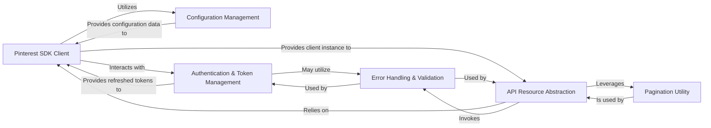

## Details

The `pinterest-python-sdk` is structured as a typical SDK/Client Library, emphasizing modularity and clear separation of concerns. The analysis reveals six core components that orchestrate the SDK's functionality, from client initialization and authentication to API resource management and utility functions.

### Pinterest SDK Client [[Expand]](./Pinterest_SDK_Client.md)

The central entry point and orchestrator of the SDK. It is responsible for initializing the client, managing API authentication (access tokens), and providing the underlying HTTP client for all API requests. It acts as the primary interface for users to interact with the Pinterest API.

**Related Classes/Methods**:

- <a href="https://github.com/pinterest/pinterest-python-sdk/blob/main/pinterest/client/__init__.py#L1-L1" target="_blank" rel="noopener noreferrer">`pinterest/client/__init__.py` (1:1)</a>

### API Resource Abstraction [[Expand]](./API_Resource_Abstraction.md)

A foundational component that provides a standardized interface for interacting with various Pinterest API resources (e.g., Ads, Campaigns, Pins, Boards). It encapsulates common CRUD (Create, Read, Update, List) operations, abstracting the direct interaction with the Pinterest API client and handling data serialization/deserialization. All specific resource managers inherit from this base.

**Related Classes/Methods**:

- <a href="https://github.com/pinterest/pinterest-python-sdk/blob/main/pinterest/utils/base_model.py#L1-L1" target="_blank" rel="noopener noreferrer">`pinterest/utils/base_model.py` (1:1)</a>

- <a href="https://github.com/pinterest/pinterest-python-sdk/blob/main/pinterest/ads/ad_accounts.py#L1-L1" target="_blank" rel="noopener noreferrer">`pinterest/ads/ad_accounts.py` (1:1)</a>

- <a href="https://github.com/pinterest/pinterest-python-sdk/blob/main/pinterest/organic/pins.py#L1-L1" target="_blank" rel="noopener noreferrer">`pinterest/organic/pins.py` (1:1)</a>

### Configuration Management

Responsible for loading and managing SDK configuration settings from various external sources, such as environment variables or JSON files. It ensures the SDK is properly initialized with necessary parameters like access tokens and API endpoints.

**Related Classes/Methods**:

- <a href="https://github.com/pinterest/pinterest-python-sdk/blob/main/pinterest/utils/load_json_config.py#L1-L1" target="_blank" rel="noopener noreferrer">`pinterest/utils/load_json_config.py` (1:1)</a>

### Authentication & Token Management

Manages the lifecycle of API access tokens, including their initial acquisition and automatic refreshing when they expire. This component ensures continuous and authenticated access to the Pinterest API without requiring manual intervention from the user.

**Related Classes/Methods**:

- <a href="https://github.com/pinterest/pinterest-python-sdk/blob/main/pinterest/utils/refresh_access_token.py#L1-L1" target="_blank" rel="noopener noreferrer">`pinterest/utils/refresh_access_token.py` (1:1)</a>

### Error Handling & Validation

Defines and manages custom exceptions specific to the SDK, providing structured and informative error reporting to the user. It also validates API responses for success or failure, raising appropriate SDK exceptions if errors are detected.

**Related Classes/Methods**:

- <a href="https://github.com/pinterest/pinterest-python-sdk/blob/main/pinterest/utils/sdk_exceptions.py#L1-L1" target="_blank" rel="noopener noreferrer">`pinterest/utils/sdk_exceptions.py` (1:1)</a>

- <a href="https://github.com/pinterest/pinterest-python-sdk/blob/main/pinterest/utils/error_handling.py#L1-L1" target="_blank" rel="noopener noreferrer">`pinterest/utils/error_handling.py` (1:1)</a>

### Pagination Utility [[Expand]](./Pagination_Utility.md)

Provides a utility for efficiently handling paginated API responses. It allows users to iterate through large datasets returned by list operations without needing to manually manage pagination tokens or offsets.

**Related Classes/Methods**:

- <a href="https://github.com/pinterest/pinterest-python-sdk/blob/main/pinterest/utils/bookmark.py#L1-L1" target="_blank" rel="noopener noreferrer">`pinterest/utils/bookmark.py` (1:1)</a>

### [FAQ](https://github.com/CodeBoarding/GeneratedOnBoardings/tree/main?tab=readme-ov-file#faq)