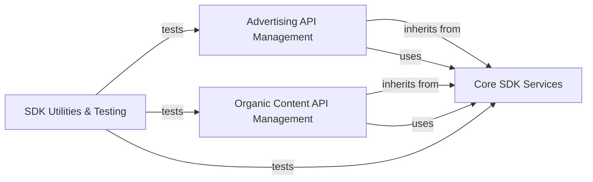

## Component Details

The `pinterest-python-sdk` provides a comprehensive interface for interacting with the Pinterest API, enabling both advertising and organic content management. The core functionality revolves around a central SDK client that handles authentication and API communication, supported by a base model for common resource operations, error handling, and pagination. Specialized components are built upon this core to manage various Pinterest entities, such as ad accounts, campaigns, ad groups, ads, audiences, conversion events, boards, and pins. The architecture also includes dedicated modules for integration testing and documentation generation, ensuring the SDK's reliability and usability.

### Core SDK Services
Provides the foundational services for the Pinterest Python SDK, including client initialization, authentication, configuration loading, base model functionalities for API interactions, error handling, and pagination. It forms the backbone for all other API-specific management components.

**Related Classes/Methods**:

- `pinterest.client.PinterestSDKClient` (full file reference)
- `pinterest.client.PinterestSDKClient.__init__` (full file reference)
- `pinterest.client.PinterestSDKClient.create_client_with_refresh_token` (full file reference)
- `pinterest.client.PinterestSDKClient.create_client_with_token` (full file reference)
- `pinterest.client.PinterestSDKClient.set_default_access_token` (full file reference)
- `pinterest.client.PinterestSDKClient.set_default_refresh_token` (full file reference)
- `pinterest.client.PinterestSDKClient.create_default_client` (full file reference)
- `pinterest.client.PinterestSDKClient._init_default_sdk_client_from_env` (full file reference)
- `pinterest.client.PinterestSDKClient._get_access_token` (full file reference)
- `pinterest.client.PinterestSDKClient._get_config` (full file reference)
- `pinterest.client.PinterestSDKClient._reset_default_client` (full file reference)
- `pinterest.client.PinterestSDKClient._set_default_client` (full file reference)
- <a href="https://github.com/pinterest/pinterest-python-sdk/blob/master/pinterest/utils/load_json_config.py#L13-L24" target="_blank" rel="noopener noreferrer">`pinterest.utils.load_json_config.load_json_config` (13:24)</a>
- <a href="https://github.com/pinterest/pinterest-python-sdk/blob/master/pinterest/utils/refresh_access_token.py#L12-L65" target="_blank" rel="noopener noreferrer">`pinterest.utils.refresh_access_token.get_new_access_token` (12:65)</a>
- <a href="https://github.com/pinterest/pinterest-python-sdk/blob/master/pinterest/utils/base_model.py#L15-L213" target="_blank" rel="noopener noreferrer">`pinterest.utils.base_model.PinterestBaseModel` (15:213)</a>
- <a href="https://github.com/pinterest/pinterest-python-sdk/blob/master/pinterest/utils/base_model.py#L20-L41" target="_blank" rel="noopener noreferrer">`pinterest.utils.base_model.PinterestBaseModel.__init__` (20:41)</a>
- <a href="https://github.com/pinterest/pinterest-python-sdk/blob/master/pinterest/utils/base_model.py#L87-L90" target="_blank" rel="noopener noreferrer">`pinterest.utils.base_model.PinterestBaseModel._get_client` (87:90)</a>
- <a href="https://github.com/pinterest/pinterest-python-sdk/blob/master/pinterest/utils/base_model.py#L93-L98" target="_blank" rel="noopener noreferrer">`pinterest.utils.base_model.PinterestBaseModel._get_api_instance` (93:98)</a>
- <a href="https://github.com/pinterest/pinterest-python-sdk/blob/master/pinterest/utils/base_model.py#L111-L163" target="_blank" rel="noopener noreferrer">`pinterest.utils.base_model.PinterestBaseModel._list` (111:163)</a>
- <a href="https://github.com/pinterest/pinterest-python-sdk/blob/master/pinterest/utils/base_model.py#L166-L183" target="_blank" rel="noopener noreferrer">`pinterest.utils.base_model.PinterestBaseModel._create` (166:183)</a>
- <a href="https://github.com/pinterest/pinterest-python-sdk/blob/master/pinterest/utils/base_model.py#L185-L213" target="_blank" rel="noopener noreferrer">`pinterest.utils.base_model.PinterestBaseModel._update` (185:213)</a>
- <a href="https://github.com/pinterest/pinterest-python-sdk/blob/master/pinterest/utils/base_model.py#L52-L81" target="_blank" rel="noopener noreferrer">`pinterest.utils.base_model.PinterestBaseModel._populate_fields` (52:81)</a>
- <a href="https://github.com/pinterest/pinterest-python-sdk/blob/master/pinterest/utils/error_handling.py#L6-L49" target="_blank" rel="noopener noreferrer">`pinterest.utils.error_handling.verify_api_response` (6:49)</a>
- <a href="https://github.com/pinterest/pinterest-python-sdk/blob/master/pinterest/utils/sdk_exceptions.py#L5-L28" target="_blank" rel="noopener noreferrer">`pinterest.utils.sdk_exceptions.SdkException` (5:28)</a>
- <a href="https://github.com/pinterest/pinterest-python-sdk/blob/master/pinterest/utils/bookmark.py#L8-L61" target="_blank" rel="noopener noreferrer">`pinterest.utils.bookmark.Bookmark` (8:61)</a>
- <a href="https://github.com/pinterest/pinterest-python-sdk/blob/master/pinterest/utils/bookmark.py#L37-L52" target="_blank" rel="noopener noreferrer">`pinterest.utils.bookmark.Bookmark.get_next` (37:52)</a>

### Advertising API Management
Manages all advertising-related entities and operations within the Pinterest API, including ad accounts, campaigns, ad groups, ads, audiences, conversion tags, conversion events, customer lists, and keywords. It leverages the Core SDK Services for underlying API interactions.

**Related Classes/Methods**:

- <a href="https://github.com/pinterest/pinterest-python-sdk/blob/master/pinterest/ads/ad_accounts.py#L22-L262" target="_blank" rel="noopener noreferrer">`pinterest.ads.ad_accounts.AdAccount` (22:262)</a>
- <a href="https://github.com/pinterest/pinterest-python-sdk/blob/master/pinterest/ads/ad_accounts.py#L27-L59" target="_blank" rel="noopener noreferrer">`pinterest.ads.ad_accounts.AdAccount.__init__` (27:59)</a>
- <a href="https://github.com/pinterest/pinterest-python-sdk/blob/master/pinterest/ads/ad_accounts.py#L102-L145" target="_blank" rel="noopener noreferrer">`pinterest.ads.ad_accounts.AdAccount.create` (102:145)</a>
- <a href="https://github.com/pinterest/pinterest-python-sdk/blob/master/pinterest/ads/ad_accounts.py#L147-L192" target="_blank" rel="noopener noreferrer">`pinterest.ads.ad_accounts.AdAccount.list_campaigns` (147:192)</a>
- <a href="https://github.com/pinterest/pinterest-python-sdk/blob/master/pinterest/ads/ad_accounts.py#L194-L229" target="_blank" rel="noopener noreferrer">`pinterest.ads.ad_accounts.AdAccount.list_audiences` (194:229)</a>
- <a href="https://github.com/pinterest/pinterest-python-sdk/blob/master/pinterest/ads/ad_accounts.py#L231-L262" target="_blank" rel="noopener noreferrer">`pinterest.ads.ad_accounts.AdAccount.list_customer_lists` (231:262)</a>
- <a href="https://github.com/pinterest/pinterest-python-sdk/blob/master/pinterest/ads/campaigns.py#L21-L541" target="_blank" rel="noopener noreferrer">`pinterest.ads.campaigns.Campaign` (21:541)</a>
- <a href="https://github.com/pinterest/pinterest-python-sdk/blob/master/pinterest/ads/campaigns.py#L26-L70" target="_blank" rel="noopener noreferrer">`pinterest.ads.campaigns.Campaign.__init__` (26:70)</a>
- <a href="https://github.com/pinterest/pinterest-python-sdk/blob/master/pinterest/ads/campaigns.py#L159-L300" target="_blank" rel="noopener noreferrer">`pinterest.ads.campaigns.Campaign.create` (159:300)</a>
- <a href="https://github.com/pinterest/pinterest-python-sdk/blob/master/pinterest/ads/campaigns.py#L303-L365" target="_blank" rel="noopener noreferrer">`pinterest.ads.campaigns.Campaign.get_all` (303:365)</a>
- <a href="https://github.com/pinterest/pinterest-python-sdk/blob/master/pinterest/ads/campaigns.py#L367-L389" target="_blank" rel="noopener noreferrer">`pinterest.ads.campaigns.Campaign.set_lifetime_budget` (367:389)</a>
- <a href="https://github.com/pinterest/pinterest-python-sdk/blob/master/pinterest/ads/campaigns.py#L391-L413" target="_blank" rel="noopener noreferrer">`pinterest.ads.campaigns.Campaign.set_daily_budget` (391:413)</a>
- <a href="https://github.com/pinterest/pinterest-python-sdk/blob/master/pinterest/ads/campaigns.py#L433-L459" target="_blank" rel="noopener noreferrer">`pinterest.ads.campaigns.Campaign._change_status` (433:459)</a>
- <a href="https://github.com/pinterest/pinterest-python-sdk/blob/master/pinterest/ads/campaigns.py#L461-L468" target="_blank" rel="noopener noreferrer">`pinterest.ads.campaigns.Campaign.pause` (461:468)</a>
- <a href="https://github.com/pinterest/pinterest-python-sdk/blob/master/pinterest/ads/campaigns.py#L470-L477" target="_blank" rel="noopener noreferrer">`pinterest.ads.campaigns.Campaign.activate` (470:477)</a>
- <a href="https://github.com/pinterest/pinterest-python-sdk/blob/master/pinterest/ads/campaigns.py#L479-L486" target="_blank" rel="noopener noreferrer">`pinterest.ads.campaigns.Campaign.archive` (479:486)</a>
- <a href="https://github.com/pinterest/pinterest-python-sdk/blob/master/pinterest/ads/campaigns.py#L488-L512" target="_blank" rel="noopener noreferrer">`pinterest.ads.campaigns.Campaign.update_fields` (488:512)</a>
- <a href="https://github.com/pinterest/pinterest-python-sdk/blob/master/pinterest/ads/campaigns.py#L514-L541" target="_blank" rel="noopener noreferrer">`pinterest.ads.campaigns.Campaign.list_ad_groups` (514:541)</a>
- <a href="https://github.com/pinterest/pinterest-python-sdk/blob/master/pinterest/ads/ad_groups.py#L21-L499" target="_blank" rel="noopener noreferrer">`pinterest.ads.ad_groups.AdGroup` (21:499)</a>
- <a href="https://github.com/pinterest/pinterest-python-sdk/blob/master/pinterest/ads/ad_groups.py#L27-L80" target="_blank" rel="noopener noreferrer">`pinterest.ads.ad_groups.AdGroup.__init__` (27:80)</a>
- <a href="https://github.com/pinterest/pinterest-python-sdk/blob/master/pinterest/ads/ad_groups.py#L219-L351" target="_blank" rel="noopener noreferrer">`pinterest.ads.ad_groups.AdGroup.create` (219:351)</a>
- <a href="https://github.com/pinterest/pinterest-python-sdk/blob/master/pinterest/ads/ad_groups.py#L353-L380" target="_blank" rel="noopener noreferrer">`pinterest.ads.ad_groups.AdGroup.update_fields` (353:380)</a>
- <a href="https://github.com/pinterest/pinterest-python-sdk/blob/master/pinterest/ads/ad_groups.py#L383-L440" target="_blank" rel="noopener noreferrer">`pinterest.ads.ad_groups.AdGroup.get_all` (383:440)</a>
- <a href="https://github.com/pinterest/pinterest-python-sdk/blob/master/pinterest/ads/ad_groups.py#L442-L479" target="_blank" rel="noopener noreferrer">`pinterest.ads.ad_groups.AdGroup.list_ads` (442:479)</a>
- <a href="https://github.com/pinterest/pinterest-python-sdk/blob/master/pinterest/ads/ad_groups.py#L481-L489" target="_blank" rel="noopener noreferrer">`pinterest.ads.ad_groups.AdGroup.enable_auto_targeting` (481:489)</a>
- <a href="https://github.com/pinterest/pinterest-python-sdk/blob/master/pinterest/ads/ad_groups.py#L491-L499" target="_blank" rel="noopener noreferrer">`pinterest.ads.ad_groups.AdGroup.disable_auto_targeting` (491:499)</a>
- <a href="https://github.com/pinterest/pinterest-python-sdk/blob/master/pinterest/ads/ads.py#L19-L444" target="_blank" rel="noopener noreferrer">`pinterest.ads.ads.Ad` (19:444)</a>
- <a href="https://github.com/pinterest/pinterest-python-sdk/blob/master/pinterest/ads/ads.py#L24-L81" target="_blank" rel="noopener noreferrer">`pinterest.ads.ads.Ad.__init__` (24:81)</a>
- <a href="https://github.com/pinterest/pinterest-python-sdk/blob/master/pinterest/ads/ads.py#L239-L339" target="_blank" rel="noopener noreferrer">`pinterest.ads.ads.Ad.create` (239:339)</a>
- <a href="https://github.com/pinterest/pinterest-python-sdk/blob/master/pinterest/ads/ads.py#L342-L418" target="_blank" rel="noopener noreferrer">`pinterest.ads.ads.Ad.get_all` (342:418)</a>
- <a href="https://github.com/pinterest/pinterest-python-sdk/blob/master/pinterest/ads/ads.py#L420-L444" target="_blank" rel="noopener noreferrer">`pinterest.ads.ads.Ad.update_fields` (420:444)</a>
- <a href="https://github.com/pinterest/pinterest-python-sdk/blob/master/pinterest/ads/audiences.py#L23-L275" target="_blank" rel="noopener noreferrer">`pinterest.ads.audiences.Audience` (23:275)</a>
- <a href="https://github.com/pinterest/pinterest-python-sdk/blob/master/pinterest/ads/audiences.py#L28-L50" target="_blank" rel="noopener noreferrer">`pinterest.ads.audiences.Audience.__init__` (28:50)</a>
- <a href="https://github.com/pinterest/pinterest-python-sdk/blob/master/pinterest/ads/audiences.py#L108-L189" target="_blank" rel="noopener noreferrer">`pinterest.ads.audiences.Audience.create` (108:189)</a>
- <a href="https://github.com/pinterest/pinterest-python-sdk/blob/master/pinterest/ads/audiences.py#L192-L251" target="_blank" rel="noopener noreferrer">`pinterest.ads.audiences.Audience.get_all` (192:251)</a>
- <a href="https://github.com/pinterest/pinterest-python-sdk/blob/master/pinterest/ads/audiences.py#L253-L275" target="_blank" rel="noopener noreferrer">`pinterest.ads.audiences.Audience.update_fields` (253:275)</a>
- <a href="https://github.com/pinterest/pinterest-python-sdk/blob/master/pinterest/ads/conversion_tags.py#L20-L314" target="_blank" rel="noopener noreferrer">`pinterest.ads.conversion_tags.ConversionTag` (20:314)</a>
- <a href="https://github.com/pinterest/pinterest-python-sdk/blob/master/pinterest/ads/conversion_tags.py#L25-L60" target="_blank" rel="noopener noreferrer">`pinterest.ads.conversion_tags.ConversionTag.__init__` (25:60)</a>
- <a href="https://github.com/pinterest/pinterest-python-sdk/blob/master/pinterest/ads/conversion_tags.py#L108-L198" target="_blank" rel="noopener noreferrer">`pinterest.ads.conversion_tags.ConversionTag.create` (108:198)</a>
- <a href="https://github.com/pinterest/pinterest-python-sdk/blob/master/pinterest/ads/conversion_tags.py#L201-L236" target="_blank" rel="noopener noreferrer">`pinterest.ads.conversion_tags.ConversionTag.get_all` (201:236)</a>
- <a href="https://github.com/pinterest/pinterest-python-sdk/blob/master/pinterest/ads/conversion_tags.py#L239-L278" target="_blank" rel="noopener noreferrer">`pinterest.ads.conversion_tags.ConversionTag.get_page_visit_conversion_tag_events` (239:278)</a>
- <a href="https://github.com/pinterest/pinterest-python-sdk/blob/master/pinterest/ads/conversion_tags.py#L281-L314" target="_blank" rel="noopener noreferrer">`pinterest.ads.conversion_tags.ConversionTag.get_ocpm_eligible_conversion_tag_events` (281:314)</a>
- <a href="https://github.com/pinterest/pinterest-python-sdk/blob/master/pinterest/ads/conversion_events.py#L96-L119" target="_blank" rel="noopener noreferrer">`pinterest.ads.conversion_events.Conversion.send_conversion_events` (96:119)</a>
- <a href="https://github.com/pinterest/pinterest-python-sdk/blob/master/pinterest/ads/conversion_events.py#L23-L93" target="_blank" rel="noopener noreferrer">`pinterest.ads.conversion_events.Conversion.create_conversion_event` (23:93)</a>
- <a href="https://github.com/pinterest/pinterest-python-sdk/blob/master/pinterest/ads/customer_lists.py#L19-L283" target="_blank" rel="noopener noreferrer">`pinterest.ads.customer_lists.CustomerList` (19:283)</a>
- <a href="https://github.com/pinterest/pinterest-python-sdk/blob/master/pinterest/ads/customer_lists.py#L24-L48" target="_blank" rel="noopener noreferrer">`pinterest.ads.customer_lists.CustomerList.__init__` (24:48)</a>
- <a href="https://github.com/pinterest/pinterest-python-sdk/blob/master/pinterest/ads/customer_lists.py#L107-L170" target="_blank" rel="noopener noreferrer">`pinterest.ads.customer_lists.CustomerList.create` (107:170)</a>
- <a href="https://github.com/pinterest/pinterest-python-sdk/blob/master/pinterest/ads/customer_lists.py#L172-L191" target="_blank" rel="noopener noreferrer">`pinterest.ads.customer_lists.CustomerList.update_fields` (172:191)</a>
- <a href="https://github.com/pinterest/pinterest-python-sdk/blob/master/pinterest/ads/customer_lists.py#L194-L244" target="_blank" rel="noopener noreferrer">`pinterest.ads.customer_lists.CustomerList.get_all` (194:244)</a>
- <a href="https://github.com/pinterest/pinterest-python-sdk/blob/master/pinterest/ads/customer_lists.py#L246-L265" target="_blank" rel="noopener noreferrer">`pinterest.ads.customer_lists.CustomerList.add_record` (246:265)</a>
- <a href="https://github.com/pinterest/pinterest-python-sdk/blob/master/pinterest/ads/customer_lists.py#L267-L283" target="_blank" rel="noopener noreferrer">`pinterest.ads.customer_lists.CustomerList.remove_record` (267:283)</a>
- <a href="https://github.com/pinterest/pinterest-python-sdk/blob/master/pinterest/ads/keywords.py#L20-L230" target="_blank" rel="noopener noreferrer">`pinterest.ads.keywords.Keyword` (20:230)</a>
- <a href="https://github.com/pinterest/pinterest-python-sdk/blob/master/pinterest/ads/keywords.py#L25-L46" target="_blank" rel="noopener noreferrer">`pinterest.ads.keywords.Keyword.__init__` (25:46)</a>
- <a href="https://github.com/pinterest/pinterest-python-sdk/blob/master/pinterest/ads/keywords.py#L89-L153" target="_blank" rel="noopener noreferrer">`pinterest.ads.keywords.Keyword.create` (89:153)</a>
- <a href="https://github.com/pinterest/pinterest-python-sdk/blob/master/pinterest/ads/keywords.py#L156-L205" target="_blank" rel="noopener noreferrer">`pinterest.ads.keywords.Keyword.get_all` (156:205)</a>
- <a href="https://github.com/pinterest/pinterest-python-sdk/blob/master/pinterest/ads/keywords.py#L207-L230" target="_blank" rel="noopener noreferrer">`pinterest.ads.keywords.Keyword.update_fields` (207:230)</a>

### Organic Content API Management
Provides functionalities for managing organic content on Pinterest, including boards, board sections, and pins. It relies on the Core SDK Services for interacting with the Pinterest API.

**Related Classes/Methods**:

- <a href="https://github.com/pinterest/pinterest-python-sdk/blob/master/pinterest/organic/boards.py#L192-L605" target="_blank" rel="noopener noreferrer">`pinterest.organic.boards.Board` (192:605)</a>
- <a href="https://github.com/pinterest/pinterest-python-sdk/blob/master/pinterest/organic/boards.py#L196-L231" target="_blank" rel="noopener noreferrer">`pinterest.organic.boards.Board.__init__` (196:231)</a>
- <a href="https://github.com/pinterest/pinterest-python-sdk/blob/master/pinterest/organic/boards.py#L292-L331" target="_blank" rel="noopener noreferrer">`pinterest.organic.boards.Board.create` (292:331)</a>
- <a href="https://github.com/pinterest/pinterest-python-sdk/blob/master/pinterest/organic/boards.py#L334-L359" target="_blank" rel="noopener noreferrer">`pinterest.organic.boards.Board.delete` (334:359)</a>
- <a href="https://github.com/pinterest/pinterest-python-sdk/blob/master/pinterest/organic/boards.py#L362-L416" target="_blank" rel="noopener noreferrer">`pinterest.organic.boards.Board.get_all` (362:416)</a>
- <a href="https://github.com/pinterest/pinterest-python-sdk/blob/master/pinterest/organic/boards.py#L418-L443" target="_blank" rel="noopener noreferrer">`pinterest.organic.boards.Board.update_fields` (418:443)</a>
- <a href="https://github.com/pinterest/pinterest-python-sdk/blob/master/pinterest/organic/boards.py#L445-L452" target="_blank" rel="noopener noreferrer">`pinterest.organic.boards.Board.make_public` (445:452)</a>
- <a href="https://github.com/pinterest/pinterest-python-sdk/blob/master/pinterest/organic/boards.py#L454-L461" target="_blank" rel="noopener noreferrer">`pinterest.organic.boards.Board.make_secret` (454:461)</a>
- <a href="https://github.com/pinterest/pinterest-python-sdk/blob/master/pinterest/organic/boards.py#L463-L480" target="_blank" rel="noopener noreferrer">`pinterest.organic.boards.Board.create_section` (463:480)</a>
- <a href="https://github.com/pinterest/pinterest-python-sdk/blob/master/pinterest/organic/boards.py#L482-L501" target="_blank" rel="noopener noreferrer">`pinterest.organic.boards.Board.update_section` (482:501)</a>
- <a href="https://github.com/pinterest/pinterest-python-sdk/blob/master/pinterest/organic/boards.py#L503-L520" target="_blank" rel="noopener noreferrer">`pinterest.organic.boards.Board.delete_section` (503:520)</a>
- <a href="https://github.com/pinterest/pinterest-python-sdk/blob/master/pinterest/organic/boards.py#L522-L554" target="_blank" rel="noopener noreferrer">`pinterest.organic.boards.Board.list_sections` (522:554)</a>
- <a href="https://github.com/pinterest/pinterest-python-sdk/blob/master/pinterest/organic/boards.py#L556-L605" target="_blank" rel="noopener noreferrer">`pinterest.organic.boards.Board.list_pins` (556:605)</a>
- <a href="https://github.com/pinterest/pinterest-python-sdk/blob/master/pinterest/organic/boards.py#L52-L80" target="_blank" rel="noopener noreferrer">`pinterest.organic.boards.BoardSection.create` (52:80)</a>
- <a href="https://github.com/pinterest/pinterest-python-sdk/blob/master/pinterest/organic/boards.py#L84-L128" target="_blank" rel="noopener noreferrer">`pinterest.organic.boards.BoardSection.get_all` (84:128)</a>
- <a href="https://github.com/pinterest/pinterest-python-sdk/blob/master/pinterest/organic/boards.py#L131-L162" target="_blank" rel="noopener noreferrer">`pinterest.organic.boards.BoardSection.update` (131:162)</a>
- <a href="https://github.com/pinterest/pinterest-python-sdk/blob/master/pinterest/organic/boards.py#L165-L189" target="_blank" rel="noopener noreferrer">`pinterest.organic.boards.BoardSection.delete` (165:189)</a>
- <a href="https://github.com/pinterest/pinterest-python-sdk/blob/master/pinterest/organic/pins.py#L16-L392" target="_blank" rel="noopener noreferrer">`pinterest.organic.pins.Pin` (16:392)</a>
- <a href="https://github.com/pinterest/pinterest-python-sdk/blob/master/pinterest/organic/pins.py#L20-L78" target="_blank" rel="noopener noreferrer">`pinterest.organic.pins.Pin.__init__` (20:78)</a>
- <a href="https://github.com/pinterest/pinterest-python-sdk/blob/master/pinterest/organic/pins.py#L179-L258" target="_blank" rel="noopener noreferrer">`pinterest.organic.pins.Pin.create` (179:258)</a>
- <a href="https://github.com/pinterest/pinterest-python-sdk/blob/master/pinterest/organic/pins.py#L261-L286" target="_blank" rel="noopener noreferrer">`pinterest.organic.pins.Pin.delete` (261:286)</a>
- <a href="https://github.com/pinterest/pinterest-python-sdk/blob/master/pinterest/organic/pins.py#L288-L315" target="_blank" rel="noopener noreferrer">`pinterest.organic.pins.Pin.save` (288:315)</a>
- <a href="https://github.com/pinterest/pinterest-python-sdk/blob/master/pinterest/organic/pins.py#L318-L392" target="_blank" rel="noopener noreferrer">`pinterest.organic.pins.Pin.get_all` (318:392)</a>

### SDK Utilities & Testing
Encompasses the integration test suite for validating SDK functionality and utility scripts for generating and managing documentation.

**Related Classes/Methods**:

- <a href="https://github.com/pinterest/pinterest-python-sdk/blob/master/integration_tests/clean_organic_data.py#L9-L25" target="_blank" rel="noopener noreferrer">`pinterest-python-sdk.integration_tests.clean_organic_data:test_delete_organic_data` (9:25)</a>
- <a href="https://github.com/pinterest/pinterest-python-sdk/blob/master/integration_tests/test_pinterest_base_model.py#L14-L27" target="_blank" rel="noopener noreferrer">`pinterest-python-sdk.integration_tests.test_pinterest_base_model.TestPinterestBaseModel:test_error_message_for_accessing_non_existant_attribute` (14:27)</a>
- <a href="https://github.com/pinterest/pinterest-python-sdk/blob/master/integration_tests/test_pinterest_base_model.py#L29-L47" target="_blank" rel="noopener noreferrer">`pinterest-python-sdk.integration_tests.test_pinterest_base_model.TestPinterestBaseModel:test_equality_of_campaign_models` (29:47)</a>
- <a href="https://github.com/pinterest/pinterest-python-sdk/blob/master/integration_tests/test_pinterest_base_model.py#L49-L60" target="_blank" rel="noopener noreferrer">`pinterest-python-sdk.integration_tests.test_pinterest_base_model.TestPinterestBaseModel:test_set_board_attributes_failure` (49:60)</a>
- <a href="https://github.com/pinterest/pinterest-python-sdk/blob/master/integration_tests/base_test.py#L41-L45" target="_blank" rel="noopener noreferrer">`pinterest-python-sdk.integration_tests.base_test.BaseTestCase:test_client` (41:45)</a>
- <a href="https://github.com/pinterest/pinterest-python-sdk/blob/master/integration_tests/ads/test_ads.py#L20-L38" target="_blank" rel="noopener noreferrer">`pinterest-python-sdk.integration_tests.ads.test_ads.TestCreateAd:test_create_ad_success` (20:38)</a>
- <a href="https://github.com/pinterest/pinterest-python-sdk/blob/master/integration_tests/ads/test_ads.py#L40-L54" target="_blank" rel="noopener noreferrer">`pinterest-python-sdk.integration_tests.ads.test_ads.TestCreateAd:test_create_ad_failure_without_creative_type` (40:54)</a>
- <a href="https://github.com/pinterest/pinterest-python-sdk/blob/master/integration_tests/ads/test_ads.py#L56-L71" target="_blank" rel="noopener noreferrer">`pinterest-python-sdk.integration_tests.ads.test_ads.TestCreateAd:test_create_ad_failure_with_incorrect_creative_type` (56:71)</a>
- <a href="https://github.com/pinterest/pinterest-python-sdk/blob/master/integration_tests/ads/test_ads.py#L77-L88" target="_blank" rel="noopener noreferrer">`pinterest-python-sdk.integration_tests.ads.test_ads.TestGetAd:test_get_ad_success` (77:88)</a>
- <a href="https://github.com/pinterest/pinterest-python-sdk/blob/master/integration_tests/ads/test_ads.py#L90-L102" target="_blank" rel="noopener noreferrer">`pinterest-python-sdk.integration_tests.ads.test_ads.TestGetAd:test_get_ad_fail_with_invalid_id` (90:102)</a>
- <a href="https://github.com/pinterest/pinterest-python-sdk/blob/master/integration_tests/ads/test_ads.py#L109-L122" target="_blank" rel="noopener noreferrer">`pinterest-python-sdk.integration_tests.ads.test_ads.TestGetListAd:test_get_all_success` (109:122)</a>
- <a href="https://github.com/pinterest/pinterest-python-sdk/blob/master/integration_tests/ads/test_ads.py#L124-L135" target="_blank" rel="noopener noreferrer">`pinterest-python-sdk.integration_tests.ads.test_ads.TestGetListAd:test_get_all_with_invalid_ids_fail` (124:135)</a>
- <a href="https://github.com/pinterest/pinterest-python-sdk/blob/master/integration_tests/ads/test_ads.py#L142-L162" target="_blank" rel="noopener noreferrer">`pinterest-python-sdk.integration_tests.ads.test_ads.TestUpdateAds:test_update_ad_success` (142:162)</a>
- <a href="https://github.com/pinterest/pinterest-python-sdk/blob/master/integration_tests/ads/test_conversion_tags.py#L15-L34" target="_blank" rel="noopener noreferrer">`pinterest-python-sdk.integration_tests.ads.test_conversion_tags.TestCreateConversionTag:test_create_conversion_tag_success` (15:34)</a>
- <a href="https://github.com/pinterest/pinterest-python-sdk/blob/master/integration_tests/ads/test_conversion_tags.py#L36-L56" target="_blank" rel="noopener noreferrer">`pinterest-python-sdk.integration_tests.ads.test_conversion_tags.TestCreateConversionTag:test_create_conversion_tag_with_configs_success` (36:56)</a>
- <a href="https://github.com/pinterest/pinterest-python-sdk/blob/master/integration_tests/ads/test_conversion_tags.py#L63-L76" target="_blank" rel="noopener noreferrer">`pinterest-python-sdk.integration_tests.ads.test_conversion_tags.TestGetConversionTag:test_get_conversion_tag_success` (63:76)</a>
- <a href="https://github.com/pinterest/pinterest-python-sdk/blob/master/integration_tests/ads/test_conversion_tags.py#L82-L102" target="_blank" rel="noopener noreferrer">`pinterest-python-sdk.integration_tests.ads.test_conversion_tags.TestGetListConversionTag:test_get_list_success` (82:102)</a>
- <a href="https://github.com/pinterest/pinterest-python-sdk/blob/master/integration_tests/ads/test_conversion_tags.py#L109-L118" target="_blank" rel="noopener noreferrer">`pinterest-python-sdk.integration_tests.ads.test_conversion_tags.TestGetPageVsitConversionTag:test_get_page_visit_success` (109:118)</a>
- <a href="https://github.com/pinterest/pinterest-python-sdk/blob/master/integration_tests/ads/test_conversion_tags.py#L124-L133" target="_blank" rel="noopener noreferrer">`pinterest-python-sdk.integration_tests.ads.test_conversion_tags.TestGetOcpmEligibleConversionTag:test_get_ocpm_eligible_conversion_tags` (124:133)</a>
- <a href="https://github.com/pinterest/pinterest-python-sdk/blob/master/integration_tests/ads/test_conversion_events.py#L21-L61" target="_blank" rel="noopener noreferrer">`pinterest-python-sdk.integration_tests.ads.test_conversion_events.TestSendConversionEvent:test_send_conversion_success` (21:61)</a>
- <a href="https://github.com/pinterest/pinterest-python-sdk/blob/master/integration_tests/ads/test_conversion_events.py#L63-L95" target="_blank" rel="noopener noreferrer">`pinterest-python-sdk.integration_tests.ads.test_conversion_events.TestSendConversionEvent:test_send_conversion_fail` (63:95)</a>
- <a href="https://github.com/pinterest/pinterest-python-sdk/blob/master/integration_tests/ads/test_campaigns.py#L24-L40" target="_blank" rel="noopener noreferrer">`pinterest-python-sdk.integration_tests.ads.test_campaigns.TestCreateCampaign:test_create_campaign_success` (24:40)</a>
- <a href="https://github.com/pinterest/pinterest-python-sdk/blob/master/integration_tests/ads/test_campaigns.py#L59-L71" target="_blank" rel="noopener noreferrer">`pinterest-python-sdk.integration_tests.ads.test_campaigns.TestCreateCampaign:test_create_campaign_failure_incorrect_objective_type` (59:71)</a>
- <a href="https://github.com/pinterest/pinterest-python-sdk/blob/master/integration_tests/ads/test_campaigns.py#L78-L92" target="_blank" rel="noopener noreferrer">`pinterest-python-sdk.integration_tests.ads.test_campaigns.TestGetCampaign:test_get_campaign_success` (78:92)</a>
- <a href="https://github.com/pinterest/pinterest-python-sdk/blob/master/integration_tests/ads/test_campaigns.py#L94-L106" target="_blank" rel="noopener noreferrer">`pinterest-python-sdk.integration_tests.ads.test_campaigns.TestGetCampaign:test_get_campaign_failure_invalid_campaign_id` (94:106)</a>
- <a href="https://github.com/pinterest/pinterest-python-sdk/blob/master/integration_tests/ads/test_campaigns.py#L113-L120" target="_blank" rel="noopener noreferrer">`pinterest-python-sdk.integration_tests.ads.test_campaigns.TestChangeCampaignStatus:test_pause_campaign_successfully` (113:120)</a>
- <a href="https://github.com/pinterest/pinterest-python-sdk/blob/master/integration_tests/ads/test_campaigns.py#L122-L129" target="_blank" rel="noopener noreferrer">`pinterest-python-sdk.integration_tests.ads.test_campaigns.TestChangeCampaignStatus:test_activate_campaign_successfully` (122:129)</a>
- <a href="https://github.com/pinterest/pinterest-python-sdk/blob/master/integration_tests/ads/test_campaigns.py#L131-L138" target="_blank" rel="noopener noreferrer">`pinterest-python-sdk.integration_tests.ads.test_campaigns.TestChangeCampaignStatus:test_archive_campaign_successfully` (131:138)</a>
- <a href="https://github.com/pinterest/pinterest-python-sdk/blob/master/integration_tests/ads/test_campaigns.py#L146-L170" target="_blank" rel="noopener noreferrer">`pinterest-python-sdk.integration_tests.ads.test_campaigns.TestGetAllCampaigns:test_get_all_campaigns` (146:170)</a>
- <a href="https://github.com/pinterest/pinterest-python-sdk/blob/master/integration_tests/ads/test_campaigns.py#L172-L201" target="_blank" rel="noopener noreferrer">`pinterest-python-sdk.integration_tests.ads.test_campaigns.TestGetAllCampaigns:test_list_ad_groups` (172:201)</a>
- <a href="https://github.com/pinterest/pinterest-python-sdk/blob/master/integration_tests/ads/test_campaigns.py#L203-L239" target="_blank" rel="noopener noreferrer">`pinterest-python-sdk.integration_tests.ads.test_campaigns.TestGetAllCampaigns:test_get_next_page_of_campaigns` (203:239)</a>
- <a href="https://github.com/pinterest/pinterest-python-sdk/blob/master/integration_tests/ads/test_ad_groups.py#L16-L38" target="_blank" rel="noopener noreferrer">`pinterest-python-sdk.integration_tests.ads.test_ad_groups.TestCreateAdGroup:test_create_ad_group_success` (16:38)</a>
- <a href="https://github.com/pinterest/pinterest-python-sdk/blob/master/integration_tests/ads/test_ad_groups.py#L40-L52" target="_blank" rel="noopener noreferrer">`pinterest-python-sdk.integration_tests.ads.test_ad_groups.TestCreateAdGroup:test_get_existing_ad_group` (40:52)</a>
- <a href="https://github.com/pinterest/pinterest-python-sdk/blob/master/integration_tests/ads/test_ad_groups.py#L59-L82" target="_blank" rel="noopener noreferrer">`pinterest-python-sdk.integration_tests.ads.test_ad_groups.TestUpdateAdGroup:test_update_success` (59:82)</a>
- <a href="https://github.com/pinterest/pinterest-python-sdk/blob/master/integration_tests/ads/test_ad_groups.py#L84-L107" target="_blank" rel="noopener noreferrer">`pinterest-python-sdk.integration_tests.ads.test_ad_groups.TestUpdateAdGroup:test_update_fail_with_invalid_tracking_urls` (84:107)</a>
- <a href="https://github.com/pinterest/pinterest-python-sdk/blob/master/integration_tests/ads/test_ad_groups.py#L114-L128" target="_blank" rel="noopener noreferrer">`pinterest-python-sdk.integration_tests.ads.test_ad_groups.TestGetListAdGroup:test_get_list_success` (114:128)</a>
- <a href="https://github.com/pinterest/pinterest-python-sdk/blob/master/integration_tests/ads/test_ad_groups.py#L130-L159" target="_blank" rel="noopener noreferrer">`pinterest-python-sdk.integration_tests.ads.test_ad_groups.TestGetListAdGroup:test_get_list_with_campaign_ids_success` (130:159)</a>
- <a href="https://github.com/pinterest/pinterest-python-sdk/blob/master/integration_tests/ads/test_ad_groups.py#L161-L172" target="_blank" rel="noopener noreferrer">`pinterest-python-sdk.integration_tests.ads.test_ad_groups.TestGetListAdGroup:test_get_list_invalid_id_fail` (161:172)</a>
- <a href="https://github.com/pinterest/pinterest-python-sdk/blob/master/integration_tests/ads/test_ad_groups.py#L179-L200" target="_blank" rel="noopener noreferrer">`pinterest-python-sdk.integration_tests.ads.test_ad_groups.TestListAds:test_list_ads_success` (179:200)</a>
- <a href="https://github.com/pinterest/pinterest-python-sdk/blob/master/integration_tests/ads/test_ad_groups.py#L202-L216" target="_blank" rel="noopener noreferrer">`pinterest-python-sdk.integration_tests.ads.test_ad_groups.TestListAds:test_enable_auto_targeting` (202:216)</a>
- <a href="https://github.com/pinterest/pinterest-python-sdk/blob/master/integration_tests/ads/test_ad_groups.py#L218-L232" target="_blank" rel="noopener noreferrer">`pinterest-python-sdk.integration_tests.ads.test_ad_groups.TestListAds:test_disable_auto_targeting` (218:232)</a>
- <a href="https://github.com/pinterest/pinterest-python-sdk/blob/master/integration_tests/ads/test_ad_accounts.py#L19-L32" target="_blank" rel="noopener noreferrer">`pinterest-python-sdk.integration_tests.ads.test_ad_accounts.TestAdAccount:test_create_ad_account` (19:32)</a>
- <a href="https://github.com/pinterest/pinterest-python-sdk/blob/master/integration_tests/ads/test_ad_accounts.py#L34-L43" target="_blank" rel="noopener noreferrer">`pinterest-python-sdk.integration_tests.ads.test_ad_accounts.TestAdAccount:test_get_existing_ad_account` (34:43)</a>
- <a href="https://github.com/pinterest/pinterest-python-sdk/blob/master/integration_tests/ads/test_ad_accounts.py#L52-L76" target="_blank" rel="noopener noreferrer">`pinterest-python-sdk.integration_tests.ads.test_ad_accounts.TestListCampaigns:test_get_all_campaigns` (52:76)</a>
- <a href="https://github.com/pinterest/pinterest-python-sdk/blob/master/integration_tests/ads/test_ad_accounts.py#L85-L110" target="_blank" rel="noopener noreferrer">`pinterest-python-sdk.integration_tests.ads.test_ad_accounts.TestListAudiences:test_get_all_audiences` (85:110)</a>
- <a href="https://github.com/pinterest/pinterest-python-sdk/blob/master/integration_tests/ads/test_ad_accounts.py#L117-L138" target="_blank" rel="noopener noreferrer">`pinterest-python-sdk.integration_tests.ads.test_ad_accounts.TestListCustomerLists:test_list_customer_list_success` (117:138)</a>
- <a href="https://github.com/pinterest/pinterest-python-sdk/blob/master/integration_tests/ads/test_audiences.py#L18-L36" target="_blank" rel="noopener noreferrer">`pinterest-python-sdk.integration_tests.ads.test_audiences.TestAudience:test_create_audience` (18:36)</a>
- <a href="https://github.com/pinterest/pinterest-python-sdk/blob/master/integration_tests/ads/test_audiences.py#L38-L48" target="_blank" rel="noopener noreferrer">`pinterest-python-sdk.integration_tests.ads.test_audiences.TestAudience:test_get_existing_audience` (38:48)</a>
- <a href="https://github.com/pinterest/pinterest-python-sdk/blob/master/integration_tests/ads/test_audiences.py#L50-L68" target="_blank" rel="noopener noreferrer">`pinterest-python-sdk.integration_tests.ads.test_audiences.TestAudience:test_update_audience_with_kwargs` (50:68)</a>
- <a href="https://github.com/pinterest/pinterest-python-sdk/blob/master/integration_tests/ads/test_audiences.py#L76-L101" target="_blank" rel="noopener noreferrer">`pinterest-python-sdk.integration_tests.ads.test_audiences.TestGetAllAudiences:test_get_all_audiences` (76:101)</a>
- <a href="https://github.com/pinterest/pinterest-python-sdk/blob/master/integration_tests/ads/test_keywords.py#L20-L35" target="_blank" rel="noopener noreferrer">`pinterest-python-sdk.integration_tests.ads.test_keywords.TestCreateKeyword:test_create_keyword_success` (20:35)</a>
- <a href="https://github.com/pinterest/pinterest-python-sdk/blob/master/integration_tests/ads/test_keywords.py#L37-L48" target="_blank" rel="noopener noreferrer">`pinterest-python-sdk.integration_tests.ads.test_keywords.TestCreateKeyword:test_create_fail_without_matchtype` (37:48)</a>
- <a href="https://github.com/pinterest/pinterest-python-sdk/blob/master/integration_tests/ads/test_keywords.py#L55-L81" target="_blank" rel="noopener noreferrer">`pinterest-python-sdk.integration_tests.ads.test_keywords.TestGetKeywords:test_get_keywords_success` (55:81)</a>
- <a href="https://github.com/pinterest/pinterest-python-sdk/blob/master/integration_tests/ads/test_keywords.py#L88-L112" target="_blank" rel="noopener noreferrer">`pinterest-python-sdk.integration_tests.ads.test_keywords.TestUpdateKeyword:test_update_keyword_success` (88:112)</a>
- <a href="https://github.com/pinterest/pinterest-python-sdk/blob/master/integration_tests/ads/test_customer_lists.py#L18-L31" target="_blank" rel="noopener noreferrer">`pinterest-python-sdk.integration_tests.ads.test_customer_lists.TestCreateCustomerList:test_create_customer_list_success` (18:31)</a>
- <a href="https://github.com/pinterest/pinterest-python-sdk/blob/master/integration_tests/ads/test_customer_lists.py#L33-L44" target="_blank" rel="noopener noreferrer">`pinterest-python-sdk.integration_tests.ads.test_customer_lists.TestCreateCustomerList:test_create_customer_list_failure_incorrect_list_type` (33:44)</a>
- <a href="https://github.com/pinterest/pinterest-python-sdk/blob/master/integration_tests/ads/test_customer_lists.py#L51-L61" target="_blank" rel="noopener noreferrer">`pinterest-python-sdk.integration_tests.ads.test_customer_lists.TestGetCustomerList:test_get_existing_customer_list_success` (51:61)</a>
- <a href="https://github.com/pinterest/pinterest-python-sdk/blob/master/integration_tests/ads/test_customer_lists.py#L68-L88" target="_blank" rel="noopener noreferrer">`pinterest-python-sdk.integration_tests.ads.test_customer_lists.TestUpdateCustomerList:test_update_field_with_append_operation_success` (68:88)</a>
- <a href="https://github.com/pinterest/pinterest-python-sdk/blob/master/integration_tests/ads/test_customer_lists.py#L90-L110" target="_blank" rel="noopener noreferrer">`pinterest-python-sdk.integration_tests.ads.test_customer_lists.TestUpdateCustomerList:test_update_field_with_remove_operation_success` (90:110)</a>
- <a href="https://github.com/pinterest/pinterest-python-sdk/blob/master/integration_tests/ads/test_customer_lists.py#L112-L127" target="_blank" rel="noopener noreferrer">`pinterest-python-sdk.integration_tests.ads.test_customer_lists.TestUpdateCustomerList:test_update_missing_require_field` (112:127)</a>
- <a href="https://github.com/pinterest/pinterest-python-sdk/blob/master/integration_tests/ads/test_customer_lists.py#L134-L161" target="_blank" rel="noopener noreferrer">`pinterest-python-sdk.integration_tests.ads.test_customer_lists.TestGetListCustomerList:test_get_all` (134:161)</a>
- <a href="https://github.com/pinterest/pinterest-python-sdk/blob/master/integration_tests/ads/test_customer_lists.py#L178-L190" target="_blank" rel="noopener noreferrer">`pinterest-python-sdk.integration_tests.ads.test_customer_lists.TestAddRemoveCustomerList:test_add_customer_list` (178:190)</a>
- <a href="https://github.com/pinterest/pinterest-python-sdk/blob/master/integration_tests/ads/test_customer_lists.py#L192-L210" target="_blank" rel="noopener noreferrer">`pinterest-python-sdk.integration_tests.ads.test_customer_lists.TestAddRemoveCustomerList:test_remove_customer_list` (192:210)</a>

### SDK Utilities & Testing
Encompasses the integration test suite for validating SDK functionality and utility scripts for generating and managing documentation.

**Related Classes/Methods**:

- <a href="https://github.com/pinterest/pinterest-python-sdk/blob/master/integration_tests/clean_organic_data.py#L9-L25" target="_blank" rel="noopener noreferrer">`pinterest-python-sdk.integration_tests.clean_organic_data:test_delete_organic_data` (9:25)</a>
- <a href="https://github.com/pinterest/pinterest-python-sdk/blob/master/integration_tests/test_pinterest_base_model.py#L14-L27" target="_blank" rel="noopener noreferrer">`pinterest-python-sdk.integration_tests.test_pinterest_base_model.TestPinterestBaseModel:test_error_message_for_accessing_non_existant_attribute` (14:27)</a>
- <a href="https://github.com/pinterest/pinterest-python-sdk/blob/master/integration_tests/test_pinterest_base_model.py#L29-L47" target="_blank" rel="noopener noreferrer">`pinterest-python-sdk.integration_tests.test_pinterest_base_model.TestPinterestBaseModel:test_equality_of_campaign_models` (29:47)</a>
- <a href="https://github.com/pinterest/pinterest-python-sdk/blob/master/integration_tests/test_pinterest_base_model.py#L49-L60" target="_blank" rel="noopener noreferrer">`pinterest-python-sdk.integration_tests.test_pinterest_base_model.TestPinterestBaseModel:test_set_board_attributes_failure` (49:60)</a>
- <a href="https://github.com/pinterest/pinterest-python-sdk/blob/master/integration_tests/base_test.py#L41-L45" target="_blank" rel="noopener noreferrer">`pinterest-python-sdk.integration_tests.base_test.BaseTestCase:test_client` (41:45)</a>
- <a href="https://github.com/pinterest/pinterest-python-sdk/blob/master/integration_tests/ads/test_ads.py#L20-L38" target="_blank" rel="noopener noreferrer">`pinterest-python-sdk.integration_tests.ads.test_ads.TestCreateAd:test_create_ad_success` (20:38)</a>
- <a href="https://github.com/pinterest/pinterest-python-sdk/blob/master/integration_tests/ads/test_ads.py#L40-L54" target="_blank" rel="noopener noreferrer">`pinterest-python-sdk.integration_tests.ads.test_ads.TestCreateAd:test_create_ad_failure_without_creative_type` (40:54)</a>
- <a href="https://github.com/pinterest/pinterest-python-sdk/blob/master/integration_tests/ads/test_ads.py#L56-L71" target="_blank" rel="noopener noreferrer">`pinterest-python-sdk.integration_tests.ads.test_ads.TestCreateAd:test_create_ad_failure_with_incorrect_creative_type` (56:71)</a>
- <a href="https://github.com/pinterest/pinterest-python-sdk/blob/master/integration_tests/ads/test_ads.py#L77-L88" target="_blank" rel="noopener noreferrer">`pinterest-python-sdk.integration_tests.ads.test_ads.TestGetAd:test_get_ad_success` (77:88)</a>
- <a href="https://github.com/pinterest/pinterest-python-sdk/blob/master/integration_tests/ads/test_ads.py#L90-L102" target="_blank" rel="noopener noreferrer">`pinterest-python-sdk.integration_tests.ads.test_ads.TestGetAd:test_get_ad_fail_with_invalid_id` (90:102)</a>
- <a href="https://github.com/pinterest/pinterest-python-sdk/blob/master/integration_tests/ads/test_ads.py#L109-L122" target="_blank" rel="noopener noreferrer">`pinterest-python-sdk.integration_tests.ads.test_ads.TestGetListAd:test_get_all_success` (109:122)</a>
- <a href="https://github.com/pinterest/pinterest-python-sdk/blob/master/integration_tests/ads/test_ads.py#L124-L135" target="_blank" rel="noopener noreferrer">`pinterest-python-sdk.integration_tests.ads.test_ads.TestGetListAd:test_get_all_with_invalid_ids_fail` (124:135)</a>
- <a href="https://github.com/pinterest/pinterest-python-sdk/blob/master/integration_tests/ads/test_ads.py#L142-L162" target="_blank" rel="noopener noreferrer">`pinterest-python-sdk.integration_tests.ads.test_ads.TestUpdateAds:test_update_ad_success` (142:162)</a>
- <a href="https://github.com/pinterest/pinterest-python-sdk/blob/master/integration_tests/ads/test_conversion_tags.py#L15-L34" target="_blank" rel="noopener noreferrer">`pinterest-python-sdk.integration_tests.ads.test_conversion_tags.TestCreateConversionTag:test_create_conversion_tag_success` (15:34)</a>
- <a href="https://github.com/pinterest/pinterest-python-sdk/blob/master/integration_tests/ads/test_conversion_tags.py#L36-L56" target="_blank" rel="noopener noreferrer">`pinterest-python-sdk.integration_tests.ads.test_conversion_tags.TestCreateConversionTag:test_create_conversion_tag_with_configs_success` (36:56)</a>
- <a href="https://github.com/pinterest/pinterest-python-sdk/blob/master/integration_tests/ads/test_conversion_tags.py#L63-L76" target="_blank" rel="noopener noreferrer">`pinterest-python-sdk.integration_tests.ads.test_conversion_tags.TestGetConversionTag:test_get_conversion_tag_success` (63:76)</a>
- <a href="https://github.com/pinterest/pinterest-python-sdk/blob/master/integration_tests/ads/test_conversion_tags.py#L82-L102" target="_blank" rel="noopener noreferrer">`pinterest-python-sdk.integration_tests.ads.test_conversion_tags.TestGetListConversionTag:test_get_list_success` (82:102)</a>
- <a href="https://github.com/pinterest/pinterest-python-sdk/blob/master/integration_tests/ads/test_conversion_tags.py#L109-L118" target="_blank" rel="noopener noreferrer">`pinterest-python-sdk.integration_tests.ads.test_conversion_tags.TestGetPageVsitConversionTag:test_get_page_visit_success` (109:118)</a>
- <a href="https://github.com/pinterest/pinterest-python-sdk/blob/master/integration_tests/ads/test_conversion_tags.py#L124-L133" target="_blank" rel="noopener noreferrer">`pinterest-python-sdk.integration_tests.ads.test_conversion_tags.TestGetOcpmEligibleConversionTag:test_get_ocpm_eligible_conversion_tags` (124:133)</a>
- <a href="https://github.com/pinterest/pinterest-python-sdk/blob/master/integration_tests/ads/test_conversion_events.py#L21-L61" target="_blank" rel="noopener noreferrer">`pinterest-python-sdk.integration_tests.ads.test_conversion_events.TestSendConversionEvent:test_send_conversion_success` (21:61)</a>
- <a href="https://github.com/pinterest/pinterest-python-sdk/blob/master/integration_tests/ads/test_conversion_events.py#L63-L95" target="_blank" rel="noopener noreferrer">`pinterest-python-sdk.integration_tests.ads.test_conversion_events.TestSendConversionEvent:test_send_conversion_fail` (63:95)</a>
- <a href="https://github.com/pinterest/pinterest-python-sdk/blob/master/integration_tests/ads/test_campaigns.py#L24-L40" target="_blank" rel="noopener noreferrer">`pinterest-python-sdk.integration_tests.ads.test_campaigns.TestCreateCampaign:test_create_campaign_success` (24:40)</a>
- <a href="https://github.com/pinterest/pinterest-python-sdk/blob/master/integration_tests/ads/test_campaigns.py#L59-L71" target="_blank" rel="noopener noreferrer">`pinterest-python-sdk.integration_tests.ads.test_campaigns.TestCreateCampaign:test_create_campaign_failure_incorrect_objective_type` (59:71)</a>
- <a href="https://github.com/pinterest/pinterest-python-sdk/blob/master/integration_tests/ads/test_campaigns.py#L78-L92" target="_blank" rel="noopener noreferrer">`pinterest-python-sdk.integration_tests.ads.test_campaigns.TestGetCampaign:test_get_campaign_success` (78:92)</a>
- <a href="https://github.com/pinterest/pinterest-python-sdk/blob/master/integration_tests/ads/test_campaigns.py#L94-L106" target="_blank" rel="noopener noreferrer">`pinterest-python-sdk.integration_tests.ads.test_campaigns.TestGetCampaign:test_get_campaign_failure_invalid_campaign_id` (94:106)</a>
- <a href="https://github.com/pinterest/pinterest-python-sdk/blob/master/integration_tests/ads/test_campaigns.py#L113-L120" target="_blank" rel="noopener noreferrer">`pinterest-python-sdk.integration_tests.ads.test_campaigns.TestChangeCampaignStatus:test_pause_campaign_successfully` (113:120)</a>
- <a href="https://github.com/pinterest/pinterest-python-sdk/blob/master/integration_tests/ads/test_campaigns.py#L122-L129" target="_blank" rel="noopener noreferrer">`pinterest-python-sdk.integration_tests.ads.test_campaigns.TestChangeCampaignStatus:test_activate_campaign_successfully` (122:129)</a>
- <a href="https://github.com/pinterest/pinterest-python-sdk/blob/master/integration_tests/ads/test_campaigns.py#L131-L138" target="_blank" rel="noopener noreferrer">`pinterest-python-sdk.integration_tests.ads.test_campaigns.TestChangeCampaignStatus:test_archive_campaign_successfully` (131:138)</a>
- <a href="https://github.com/pinterest/pinterest-python-sdk/blob/master/integration_tests/ads/test_campaigns.py#L146-L170" target="_blank" rel="noopener noreferrer">`pinterest-python-sdk.integration_tests.ads.test_campaigns.TestGetAllCampaigns:test_get_all_campaigns` (146:170)</a>
- <a href="https://github.com/pinterest/pinterest-python-sdk/blob/master/integration_tests/ads/test_campaigns.py#L172-L201" target="_blank" rel="noopener noreferrer">`pinterest-python-sdk.integration_tests.ads.test_campaigns.TestGetAllCampaigns:test_list_ad_groups` (172:201)</a>
- <a href="https://github.com/pinterest/pinterest-python-sdk/blob/master/integration_tests/ads/test_campaigns.py#L203-L239" target="_blank" rel="noopener noreferrer">`pinterest-python-sdk.integration_tests.ads.test_campaigns.TestGetAllCampaigns:test_get_next_page_of_campaigns` (203:239)</a>
- <a href="https://github.com/pinterest/pinterest-python-sdk/blob/master/integration_tests/ads/test_ad_groups.py#L16-L38" target="_blank" rel="noopener noreferrer">`pinterest-python-sdk.integration_tests.ads.test_ad_groups.TestCreateAdGroup:test_create_ad_group_success` (16:38)</a>
- <a href="https://github.com/pinterest/pinterest-python-sdk/blob/master/integration_tests/ads/test_ad_groups.py#L40-L52" target="_blank" rel="noopener noreferrer">`pinterest-python-sdk.integration_tests.ads.test_ad_groups.TestCreateAdGroup:test_get_existing_ad_group` (40:52)</a>
- <a href="https://github.com/pinterest/pinterest-python-sdk/blob/master/integration_tests/ads/test_ad_groups.py#L59-L82" target="_blank" rel="noopener noreferrer">`pinterest-python-sdk.integration_tests.ads.test_ad_groups.TestUpdateAdGroup:test_update_success` (59:82)</a>
- <a href="https://github.com/pinterest/pinterest-python-sdk/blob/master/integration_tests/ads/test_ad_groups.py#L84-L107" target="_blank" rel="noopener noreferrer">`pinterest-python-sdk.integration_tests.ads.test_ad_groups.TestUpdateAdGroup:test_update_fail_with_invalid_tracking_urls` (84:107)</a>
- <a href="https://github.com/pinterest/pinterest-python-sdk/blob/master/integration_tests/ads/test_ad_groups.py#L114-L128" target="_blank" rel="noopener noreferrer">`pinterest-python-sdk.integration_tests.ads.test_ad_groups.TestGetListAdGroup:test_get_list_success` (114:128)</a>
- <a href="https://github.com/pinterest/pinterest-python-sdk/blob/master/integration_tests/ads/test_ad_groups.py#L130-L159" target="_blank" rel="noopener noreferrer">`pinterest-python-sdk.integration_tests.ads.test_ad_groups.TestGetListAdGroup:test_get_list_with_campaign_ids_success` (130:159)</a>
- <a href="https://github.com/pinterest/pinterest-python-sdk/blob/master/integration_tests/ads/test_ad_groups.py#L161-L172" target="_blank" rel="noopener noreferrer">`pinterest-python-sdk.integration_tests.ads.test_ad_groups.TestGetListAdGroup:test_get_list_invalid_id_fail` (161:172)</a>
- <a href="https://github.com/pinterest/pinterest-python-sdk/blob/master/integration_tests/ads/test_ad_groups.py#L179-L200" target="_blank" rel="noopener noreferrer">`pinterest-python-sdk.integration_tests.ads.test_ad_groups.TestListAds:test_list_ads_success` (179:200)</a>
- <a href="https://github.com/pinterest/pinterest-python-sdk/blob/master/integration_tests/ads/test_ad_groups.py#L202-L216" target="_blank" rel="noopener noreferrer">`pinterest-python-sdk.integration_tests.ads.test_ad_groups.TestListAds:test_enable_auto_targeting` (202:216)</a>
- <a href="https://github.com/pinterest/pinterest-python-sdk/blob/master/integration_tests/ads/test_ad_groups.py#L218-L232" target="_blank" rel="noopener noreferrer">`pinterest-python-sdk.integration_tests.ads.test_ad_groups.TestListAds:test_disable_auto_targeting` (218:232)</a>
- <a href="https://github.com/pinterest/pinterest-python-sdk/blob/master/integration_tests/ads/test_ad_accounts.py#L19-L32" target="_blank" rel="noopener noreferrer">`pinterest-python-sdk.integration_tests.ads.test_ad_accounts.TestAdAccount:test_create_ad_account` (19:32)</a>
- <a href="https://github.com/pinterest/pinterest-python-sdk/blob/master/integration_tests/ads/test_ad_accounts.py#L34-L43" target="_blank" rel="noopener noreferrer">`pinterest-python-sdk.integration_tests.ads.test_ad_accounts.TestAdAccount:test_get_existing_ad_account` (34:43)</a>
- <a href="https://github.com/pinterest/pinterest-python-sdk/blob/master/integration_tests/ads/test_ad_accounts.py#L52-L76" target="_blank" rel="noopener noreferrer">`pinterest-python-sdk.integration_tests.ads.test_ad_accounts.TestListCampaigns:test_get_all_campaigns` (52:76)</a>
- <a href="https://github.com/pinterest/pinterest-python-sdk/blob/master/integration_tests/ads/test_ad_accounts.py#L85-L110" target="_blank" rel="noopener noreferrer">`pinterest-python-sdk.integration_tests.ads.test_ad_accounts.TestListAudiences:test_get_all_audiences` (85:110)</a>
- <a href="https://github.com/pinterest/pinterest-python-sdk/blob/master/integration_tests/ads/test_ad_accounts.py#L117-L138" target="_blank" rel="noopener noreferrer">`pinterest-python-sdk.integration_tests.ads.test_ad_accounts.TestListCustomerLists:test_list_customer_list_success` (117:138)</a>
- <a href="https://github.com/pinterest/pinterest-python-sdk/blob/master/integration_tests/ads/test_audiences.py#L18-L36" target="_blank" rel="noopener noreferrer">`pinterest-python-sdk.integration_tests.ads.test_audiences.TestAudience:test_create_audience` (18:36)</a>
- <a href="https://github.com/pinterest/pinterest-python-sdk/blob/master/integration_tests/ads/test_audiences.py#L38-L48" target="_blank" rel="noopener noreferrer">`pinterest-python-sdk.integration_tests.ads.test_audiences.TestAudience:test_get_existing_audience` (38:48)</a>
- <a href="https://github.com/pinterest/pinterest-python-sdk/blob/master/integration_tests/ads/test_audiences.py#L50-L68" target="_blank" rel="noopener noreferrer">`pinterest-python-sdk.integration_tests.ads.test_audiences.TestAudience:test_update_audience_with_kwargs` (50:68)</a>
- <a href="https://github.com/pinterest/pinterest-python-sdk/blob/master/integration_tests/ads/test_audiences.py#L76-L101" target="_blank" rel="noopener noreferrer">`pinterest-python-sdk.integration_tests.ads.test_audiences.TestGetAllAudiences:test_get_all_audiences` (76:101)</a>
- <a href="https://github.com/pinterest/pinterest-python-sdk/blob/master/integration_tests/ads/test_keywords.py#L20-L35" target="_blank" rel="noopener noreferrer">`pinterest-python-sdk.integration_tests.ads.test_keywords.TestCreateKeyword:test_create_keyword_success` (20:35)</a>
- <a href="https://github.com/pinterest/pinterest-python-sdk/blob/master/integration_tests/ads/test_keywords.py#L37-L48" target="_blank" rel="noopener noreferrer">`pinterest-python-sdk.integration_tests.ads.test_keywords.TestCreateKeyword:test_create_fail_without_matchtype` (37:48)</a>
- <a href="https://github.com/pinterest/pinterest-python-sdk/blob/master/integration_tests/ads/test_keywords.py#L55-L81" target="_blank" rel="noopener noreferrer">`pinterest-python-sdk.integration_tests.ads.test_keywords.TestGetKeywords:test_get_keywords_success` (55:81)</a>
- <a href="https://github.com/pinterest/pinterest-python-sdk/blob/master/integration_tests/ads/test_keywords.py#L88-L112" target="_blank" rel="noopener noreferrer">`pinterest-python-sdk.integration_tests.ads.test_keywords.TestUpdateKeyword:test_update_keyword_success` (88:112)</a>
- <a href="https://github.com/pinterest/pinterest-python-sdk/blob/master/integration_tests/ads/test_customer_lists.py#L18-L31" target="_blank" rel="noopener noreferrer">`pinterest-python-sdk.integration_tests.ads.test_customer_lists.TestCreateCustomerList:test_create_customer_list_success` (18:31)</a>
- <a href="https://github.com/pinterest/pinterest-python-sdk/blob/master/integration_tests/ads/test_customer_lists.py#L33-L44" target="_blank" rel="noopener noreferrer">`pinterest-python-sdk.integration_tests.ads.test_customer_lists.TestCreateCustomerList:test_create_customer_list_failure_incorrect_list_type` (33:44)</a>
- <a href="https://github.com/pinterest/pinterest-python-sdk/blob/master/integration_tests/ads/test_customer_lists.py#L51-L61" target="_blank" rel="noopener noreferrer">`pinterest-python-sdk.integration_tests.ads.test_customer_lists.TestGetCustomerList:test_get_existing_customer_list_success` (51:61)</a>
- <a href="https://github.com/pinterest/pinterest-python-sdk/blob/master/integration_tests/ads/test_customer_lists.py#L68-L88" target="_blank" rel="noopener noreferrer">`pinterest-python-sdk.integration_tests.ads.test_customer_lists.TestUpdateCustomerList:test_update_field_with_append_operation_success` (68:88)</a>
- <a href="https://github.com/pinterest/pinterest-python-sdk/blob/master/integration_tests/ads/test_customer_lists.py#L90-L110" target="_blank" rel="noopener noreferrer">`pinterest-python-sdk.integration_tests.ads.test_customer_lists.TestUpdateCustomerList:test_update_field_with_remove_operation_success` (90:110)</a>
- <a href="https://github.com/pinterest/pinterest-python-sdk/blob/master/integration_tests/ads/test_customer_lists.py#L112-L127" target="_blank" rel="noopener noreferrer">`pinterest-python-sdk.integration_tests.ads.test_customer_lists.TestUpdateCustomerList:test_update_missing_require_field` (112:127)</a>
- <a href="https://github.com/pinterest/pinterest-python-sdk/blob/master/integration_tests/ads/test_customer_lists.py#L134-L161" target="_blank" rel="noopener noreferrer">`pinterest-python-sdk.integration_tests.ads.test_customer_lists.TestGetListCustomerList:test_get_all` (134:161)</a>
- <a href="https://github.com/pinterest/pinterest-python-sdk/blob/master/integration_tests/ads/test_customer_lists.py#L178-L190" target="_blank" rel="noopener noreferrer">`pinterest-python-sdk.integration_tests.ads.test_customer_lists.TestAddRemoveCustomerList:test_add_customer_list` (178:190)</a>
- <a href="https://github.com/pinterest/pinterest-python-sdk/blob/master/integration_tests/ads/test_customer_lists.py#L192-L210" target="_blank" rel="noopener noreferrer">`pinterest-python-sdk.integration_tests.ads.test_customer_lists.TestAddRemoveCustomerList:test_remove_customer_list` (192:210)</a>
- <a href="https://github.com/pinterest/pinterest-python-sdk/blob/master/docs/utils/script.py#L118-L163" target="_blank" rel="noopener noreferrer">`pinterest-python-sdk.docs.utils.script:create_file_index` (118:163)</a>
- <a href="https://github.com/pinterest/pinterest-python-sdk/blob/master/docs/utils/script.py#L178-L219" target="_blank" rel="noopener noreferrer">`pinterest-python-sdk.docs.utils.script:append_doc_to_spec_file` (178:219)</a>
- <a href="https://github.com/pinterest/pinterest-python-sdk/blob/master/docs/utils/script.py#L222-L234" target="_blank" rel="noopener noreferrer">`pinterest-python-sdk.docs.utils.script:start_doc` (222:234)</a>
- <a href="https://github.com/pinterest/pinterest-python-sdk/blob/master/docs/utils/script.py#L65-L79" target="_blank" rel="noopener noreferrer">`pinterest-python-sdk.docs.utils.script.sort_index` (65:79)</a>
- <a href="https://github.com/pinterest/pinterest-python-sdk/blob/master/docs/utils/script.py#L100-L115" target="_blank" rel="noopener noreferrer">`pinterest-python-sdk.docs.utils.script.check_index` (100:115)</a>
- <a href="https://github.com/pinterest/pinterest-python-sdk/blob/master/docs/utils/script.py#L166-L175" target="_blank" rel="noopener noreferrer">`pinterest-python-sdk.docs.utils.script.truncate_md_extension` (166:175)</a>
- <a href="https://github.com/pinterest/pinterest-python-sdk/blob/master/docs/utils/script.py#L82-L97" target="_blank" rel="noopener noreferrer">`pinterest-python-sdk.docs.utils.script.remove_module_prefix_from_file` (82:97)</a>
- <a href="https://github.com/pinterest/pinterest-python-sdk/blob/master/docs/utils/script.py#L31-L35" target="_blank" rel="noopener noreferrer">`pinterest-python-sdk.docs.utils.script.set_up_python_path` (31:35)</a>
- <a href="https://github.com/pinterest/pinterest-python-sdk/blob/master/docs/utils/script.py#L38-L45" target="_blank" rel="noopener noreferrer">`pinterest-python-sdk.docs.utils.script.remove_old_doc` (38:45)</a>
- <a href="https://github.com/pinterest/pinterest-python-sdk/blob/master/docs/utils/script.py#L48-L62" target="_blank" rel="noopener noreferrer">`pinterest-python-sdk.docs.utils.script.generate_new_doc` (48:62)</a>

### [FAQ](https://github.com/CodeBoarding/GeneratedOnBoardings/tree/main?tab=readme-ov-file#faq)